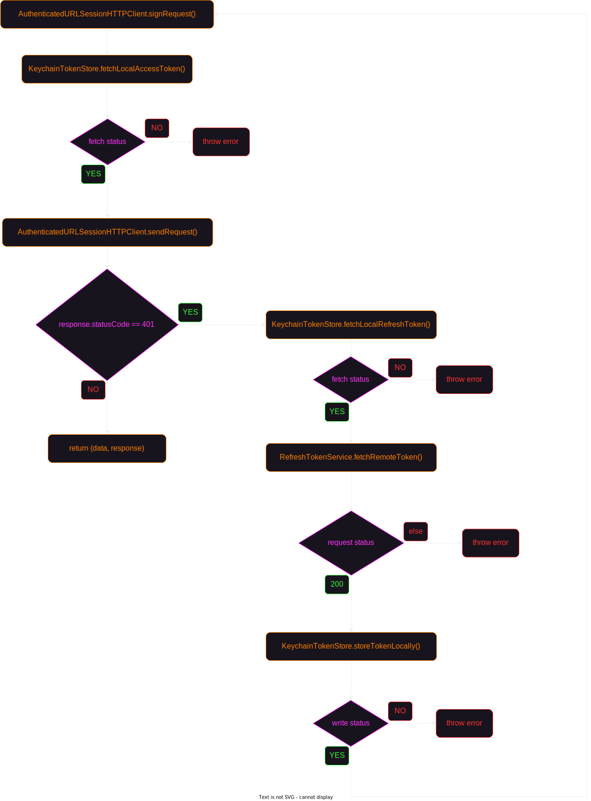

# Foodybite

💡The idea behind it is to create a simple way to find restaurants near you. Users can set their preferred radius and number of stars to filter restaurants based on location and rating. Additionally, they can see details, like opening hours, address, reviews, or photos for each restaurant found and give a review. The app offers the capability to search directly for a restaurant and give the opportunity to the user to give a review right away.

1. [Motivation](#motivation)
2. [Architecture](#architecture)
    1. [Overview](#overview)
    2. [Domain](#domain)
    3. [Networking](#networking)
        1. [Refresh Token Strategy](#1-refresh-token-strategy)
        2. [Network Request Flow](#2-network-request-flow)
        3. [Endpoint Creation](#3-endpoint-creation)
        4. [Testing `Data` to `Decodable` Mapping](#4-testing-data-to-decodable-mapping)
        5. [Parsing JSON Response](#5-parsing-json-response)
    4. [Places](#places)
    5. [API Infra](#api-infra)
        1. [Mock Network Requests](#mock-network-requests)
    6. [Persistence](#persistence)
        1. [Cache Domain Models](#cache-domain-models)
        2. [Infrastructure](#infrastructure)
        3. [Store User Preferences](#store-user-preferences)
    7. [Location](#location)
        1. [From delegation to async/await](#from-delegation-to-asyncawait)
        2. [Get current location using TDD](#get-current-location-using-tdd)
    8. [Presentation](#presentation)
    9. [UI](#ui)
    10. [Main](#main)
        1. [Adding caching by intercepting network requests](#adding-caching-by-intercepting-network-requests) (`Decorator Pattern`)
        2. [Adding fallback strategies when network requests fail](#adding-fallback-strategies-when-network-requests-fail) (`Composite Pattern`)
        3. [Handling navigation](#handling-navigation) (flat and hierarchical navigation)
3. [Testing Strategy](#testing-strategy)
    1. [Summary Table](#summary-table)
    2. [Methodology](#methodology)
    3. [Unit Tests](#unit-tests)
    4. [Integration Tests](#integration-tests)
        1. [End-to-End Tests](#end-to-end-tests)
        2. [Cache Integration Tests](#cache-integration-tests)
    5. [Snapshot Tests](#snapshot-tests)
4. [CI/CD](#cicd)
5. [Security](#security)
    1. [API key for Google Places API](#api-key-for-google-places-api)
    2. [Store Tokens from FoodybiteServer in Keychain](#store-tokens-from-foodybiteserver-in-keychain)
    3. [Password Hashing](#password-hashing)
6. [Metrics](#metrics)
7. [Credits](#credits)
8. [References](#references)

## Motivation

The initial spark of this project was when I felt it was the right time to dive deeper in `SwiftUI` since I had seen the potential of the framework and my curiosity drove me to use it in a larger project as I had already been using it for testing its functionalities.

After finishing the UI, the next challenge I gave to myself was to design the app in the best possible way using all the best practices in order to create a high quality project and sharp my skills. At the same time, my interest in TDD and modular design were emerging, that's the reason I only used TDD when writing all modules besides UI (used it for snapshot tests afterwards 😀). 

In the process, I was able to significantly improve my TDD skills and acknowledge its value as it helped me understand better what I was trying to achieve before writing the code because I needed to have a clear picture of what I wanted to test first. On the other hand, the architecture seemed to materialize while I was writing the tests and by using TDD I could further improve the initial design.

You can find below the entire process I've gone through while designing this project, the decisions and trade-offs I've made regarding the architecture, how I structured the testing pyramid, what were some security issues I needed to consider and some really cool metrics about the evolution of the codebase.

Thank you for reading and enjoy! 🚀

## Architecture

### Overview

For this project, I chose to organize the project into independent frameworks using horizontal slicing and break down the app into layers, respecting the dependency rule:

> ❗️ High-level modules should not depend on lower-level modules and lower-level modules should only communicate and know about the next higher-level layer.

I think it's the best approach for this project since vertical slicing is more suitable for larger projects with feature teams. Also, the number of features isn't that high in order to make the layers bloated with a large number of classes and become unmanageable. 

The following diagram provides a top-level view with all modules from this project along with their dependencies on other modules:
1. [Domain](#domain)
2. [Networking](#networking)
3. [Places](#places)
4. [API Infra](#api-infra)
5. [Persistence](#persistence)
6. [Location](#location)
7. [Presentation](#presentation)
8. [UI](#ui)
9. [Main](#main)


### Domain

This layer is the most inner layer in the architecture (no dependencies with other layers). It contains only models and abstractions for 
- fetching or saving data implemented by the [Networking](#networking), [Places](#places) and [Persistence](#persistence) modules
- getting the current location implemented by the [Location](#location) module
- the [Presentation](#presentation) module to get the data it needs and converting it in the format the [UI](#ui) module requires it.

#### 1. User Session Feature

Model: User
```swift
public struct User: Equatable {
    public let id: UUID
    public let name: String
    public let email: String
    public let profileImage: Data?
    
    public init(id: UUID, name: String, email: String, profileImage: Data?) {
        self.id = id
        self.name = name
        self.email = email
        self.profileImage = profileImage
    }
}
```

Protocols:
1. SignUpService
```swift
public protocol SignUpService {
    func signUp(name: String, email: String, password: String, confirmPassword: String, profileImage: Data?) async throws
}
```

2. LoginService
```swift
public protocol LoginService {
    func login(email: String, password: String) async throws -> User
}
```

3. LogoutService
```swift
public protocol LogoutService {
    func logout() async throws
}
```

#### 2. Update/Delete Account Feature

Protocols:
1. AccountService
```swift
public protocol AccountService {
    func updateAccount(name: String, email: String, profileImage: Data?) async throws
    func deleteAccount() async throws
}
```

2. ChangePasswordService
```swift
public protocol ChangePasswordService {
    func changePassword(currentPassword: String, newPassword: String, confirmPassword: String) async throws
}
```

#### 3. Store/Retrieve User Preferences Feature

Domain Model: UserPreferences
```swift
public struct UserPreferences: Equatable {
    public let radius: Int
    public let starsNumber: Int
    
    public static let `default` = UserPreferences(radius: 10_000, starsNumber: 0)
    
    public init(radius: Int, starsNumber: Int) {
        self.radius = radius
        self.starsNumber = starsNumber
    }
}
```

Protocols:
1. UserPreferencesSaver
```swift
public protocol UserPreferencesSaver {
    func save(_ userPreferences: UserPreferences)
}
```

2. UserPreferencesLoader
```swift
public protocol UserPreferencesLoader {
    func load() -> UserPreferences
}
```

#### 4. Add Review Feature

Domain Model: Review
```swift
public struct Review: Equatable, Identifiable, Hashable {
    public var id: UUID
    public let placeID: String
    public let profileImageURL: URL?
    public let profileImageData: Data?
    public let authorName: String
    public let reviewText: String
    public let rating: Int
    public let relativeTime: String
}
```

Protocol: AddReviewService
```swift
public protocol AddReviewService {
    func addReview(placeID: String, reviewText: String, starsNumber: Int, createdAt: Date) async throws
}
```

#### 5. Get Reviews Feature

Domain Model (same `Review` model as for `Add Review Feature`)

Protocol: GetReviewsService
```swift
public protocol GetReviewsService {
    func getReviews(placeID: String?) async throws -> [Review]
}
```

#### 6. Search Nearby Feature

Domain Models:
1. NearbyPlace
```swift
public struct NearbyPlace: Equatable {
    public let placeID: String
    public let placeName: String
    public let isOpen: Bool
    public let rating: Double
    public let location: Location
    public let photo: Photo?
}
```

2. Location
```swift
public struct Location: Equatable, Hashable {
    public let latitude: Double
    public let longitude: Double
}
```

3. Photo
```swift
public struct Photo: Equatable, Hashable {
    public let width: Int
    public let height: Int
    public let photoReference: String
}
```

Protocol: SearchNearbyService
```swift
public protocol SearchNearbyService {
    func searchNearby(location: Location, radius: Int) async throws -> [NearbyPlace]
}
```

#### 7. Get Place Details Feature

Domain Models:
1. PlaceDetails
```swift
public struct PlaceDetails: Equatable, Hashable {
    public let placeID: String
    public let phoneNumber: String?
    public let name: String
    public let address: String
    public let rating: Double
    public let openingHoursDetails: OpeningHoursDetails?
    public var reviews: [Review]
    public let location: Location
    public let photos: [Photo]
}
```

2. OpeningHoursDetails
```swift
public struct OpeningHoursDetails: Equatable, Hashable {
    public let openNow: Bool
    public let weekdayText: [String]
}
```

3. Review (same model as for `Add Review Feature`)

Protocol: GetPlaceDetailsService
```swift
public protocol GetPlaceDetailsService {
    func getPlaceDetails(placeID: String) async throws -> PlaceDetails
}
```

#### 8. Fetch Place Photo Feature

Domain Model (same `Photo` model as for `Search Nearby Feature`)

Protocol: FetchPlacePhotoService
```swift
public protocol FetchPlacePhotoService {
    func fetchPlacePhoto(photoReference: String) async throws -> Data
}
```

#### 9. Autocomplete Feature (Search Places)

Domain Model: AutocompletePrediction
```swift
public struct AutocompletePrediction: Equatable {
    public let placePrediction: String
    public let placeID: String
}
```

Protocol: AutocompletePlacesService
```swift
public protocol AutocompletePlacesService {
    func autocomplete(input: String, location: Location, radius: Int) async throws -> [AutocompletePrediction]
}
```

#### 10. Get Current Location Feature

Domain Model (same `Location` model as for `Search Nearby Feature`)

Protocol: LocationProviding
```swift
public protocol LocationProviding {
    var locationServicesEnabled: Bool { get }
    
    func requestLocation() async throws -> Location
}
```

#### 11. Cache Reviews Feature

Domain Model (same `Review` model as for `Add Review Feature`)

Protocol: ReviewCache
```swift
public protocol ReviewCache {
    func save(reviews: [Review]) async throws
}
```

#### 12. Cache Nearby Places Feature

Domain Model (same `NearbyPlace` model as for `Search Nearby Feature`)

Protocol: SearchNearbyCache
```swift
public protocol SearchNearbyCache {
    func save(nearbyPlaces: [NearbyPlace]) async throws
}
```

#### 13. Cache Place Details Feature

Domain Model (same `PlaceDetails` model as for `Get Place Details Feature`)

Protocol: PlaceDetailsCache
```swift
public protocol PlaceDetailsCache {
    func save(placeDetails: PlaceDetails) async throws
}
```

### Networking
The following diagram represents the networking layer talking with my backend app. For a better understanding, I will explain each major section of the diagram and decisions made during testing (all components were tested using TDD):
1. [Refresh Token Strategy](#1-refresh-token-strategy)
2. [Network Request Flow](#2-network-request-flow)
3. [Endpoint Creation](#3-endpoint-creation)
4. [Testing `Data` to `Decodable` Mapping](#4-testing-data-to-decodable-mapping)
5. [Parsing JSON Response](#5-parsing-json-response)


| Component | Responsibility |
|------|------|
| KeychainTokenStore | Performs read/write operations from/to Keychain on AuthToken |
| RefreshTokenService | Fetches new `AuthToken` from server and stores it in `TokenStore` |
| RefreshTokenEndpoint | Creates `URLRequest` for generating new access and refresh tokens |
| AuthToken | Struct containing accessToken and refreshToken |
| AuthenticatedURLSessionHTTPClient | Decorator over `HTTPClient` that adds authentication capabilities to the client |
| RemoteStore | Validates the response from `HTTPClient` and parses the data |
| APIService | Creates the endpoints and sends them to the `ResourceLoader` or `ResourceSender` |
| LoginEndpoint | Creates `URLRequest` for authentication |
| SignUpEndpoint | Creates `URLRequest` for creating an account |
| AccountEndpoint | Creates `URLRequest` for updating the current account or delete it |
| LogoutEndpoint | Creates `URLRequest` for ending the current session |
| ChangePasswordEndpoint | Creates `URLRequest` for changing the password |
| ReviewEndpoint | Creates `URLRequest` for adding a review or getting all reviews for a particular restaurant |

#### 1. Refresh Token Strategy

The following diagram presents the entire state machine for making requests that require authentication.



In order to avoid making multiple `refreshTokens` requests when they were requested multiple times in parallel, I stored the first task in an instance property. The first request creates the task and the following requests are just waiting for the task value (in this case, the value is `Void`, so the rest of the requests only waits for the completion of the task).

```swift
public func fetchLocallyRemoteToken() async throws {
    if let refreshTask = refreshTask {
        return try await refreshTask.value
    }
    
    let urlRequest = try createURLRequest()
    
    let task: Task<Void, Error> = Task {
        let remoteAuthToken: AuthToken = try await loader.get(for: urlRequest)
        try tokenStore.write(remoteAuthToken)
        
        refreshTask = nil
    }
    
    refreshTask = task
    try await task.value
}
```

I used a `TaskGroup` for testing this behaviour to trigger multiple requests for `AuthToken` in parallel, validating that only one request is actually made and all the other requests receive the token stored by the first request.

```swift
func test_fetchLocallyRemoteToken_makesRefreshTokenRequestOnlyOnceWhenCalledMultipleTimesInParallel() async throws {
    let (sut, loaderSpy, _) = makeSUT(authToken: makeRemoteAuthToken())
    
    await requestRemoteAuthTokenInParallel(on: sut, numberOfRequests: 10)
    
    XCTAssertEqual(loaderSpy.requests.count, 1)
}

private func requestRemoteAuthTokenInParallel(on sut: TokenRefresher, numberOfRequests: Int) async {
    await withThrowingTaskGroup(of: Void.self) { group in
        (0..<numberOfRequests).forEach { _ in
            group.addTask {
                try await sut.fetchLocallyRemoteToken()
            }
        }
    }
}
```

Additionally, `RefreshTokenService` is an actor because I want to prevent potential race conditions that can occur while mutating the `refreshTask` instance property from different threads. Also, the actor is instantiated in the composition root only once, meaning it has a singleton lifetime, preventing multiple instances of `RefreshTokenService` to make concurrent `refreshTokens` requests.

```swift
public actor RefreshTokenService: TokenRefresher {
    private let loader: ResourceLoader
    private let tokenStore: TokenStore
    private var refreshTask: Task<Void, Error>?
    ...
}
```

#### 2. Network Request Flow

This flow is composed by 3 classes: 
- `APIService`, which implements domain protocols, creates `URLRequest` objects from endpoints and sends them to the remote store.
- `RemoteStore`, which implements `ResourceLoader` and `ResourceSender`, validates the status code returned by the client and parses received data.
- `AuthenticatedURLSessionHTTPClient`, which decorates `HTTPClient`, signs each request using the access token fetched using an `TokenRefresher` collaborator (You can find more details about refresh token strategy [here](#1-refresh-token-strategy)). In the `Composition Root` this class is used only for requests that require authentication, otherwise an instance of `URLSessionHTTPClient` from the `API Infra` module is used.


#### 3. Endpoint Creation

Initially, I created a single enum with individual cases for each request which conformed to the `Endpoint` protocol. It was a convenient choice because all requests available were grouped in a single file, but as I was adding more requests I realized that each time the same file is modified, thus breaking the `Open/Closed Principle` which states that the system should be open for extension, but closed for modification.

I immediately pivoted and extracted the related cases in separate enums with related cases, like it is the case for `AccountEndpoint` which has cases for `POST` and `DELETE`. 

```swift
enum AccountEndpoint: Endpoint {
    case post(UpdateAccountRequestBody)
    case delete
    
    var path: String {
        "/auth/account"
    }
    
    var method: RequestMethod {
        switch self {
        case .delete:
            return .delete
        case .post:
            return .post
        }
    }
    
    var body: Encodable? {
        switch self {
        case let .post(updateAccountBody):
            return updateAccountBody
        case .delete:
            return nil
        }
    }
}
```

Otherwise, if a case is not related any other case then I extracted it in a struct with the body as the instance property.

```swift
struct LoginEndpoint: Endpoint {
    private let requestBody: LoginRequestBody
    
    init(requestBody: LoginRequestBody) {
        self.requestBody = requestBody
    }

    var path: String {
        "/auth/login"
    }
    
    var method: RequestMethod {
        .post
    }
    
    var body: Encodable? {
        requestBody
    }
}
```
Currently, when the need to add another endpoint arises, I can create another struct which conforms to `Endpoint` or edit a file containing related endpoints to the one I want to add (this case still violates the principle, but considering the relatedness of the endpoints I think it's a good trade-off for now).

#### 4. Testing `Data` to `Decodable` Mapping

For testing the mapping from `Data` to `Decodable` I chose to test it directly in the `RemoteStore`, hiding the knowledge of a collaborator (in this case `CodableDataParser`). While I could do this using a stubbed collaborator (e.g. a protocol `DataParser`), I prefered to test in integration the mapping, resulting in less complexity and less coupling of tests with the production code.

#### 5. Parsing JSON Response

To parse the JSON received from the server I had had two alternatives:
1. To make domain models conform to `Codable` and use them directly to decode the data
2. Create distinct representation for each domain model that needs to be parse

I end up choosing the second approach as I didn't want to leak details implementation of the concrete implementation outside of the module because it would reduce its encapsulation by letting other modules know how it does the JSON parsing.

### Places

The following diagram presents the `Places` module which has as a dependency `API Infra` because it shares the need to fetch resources over the network with the `Networking` module. This module calls [`Google Places APIs`](https://developers.google.com/maps/documentation/places/web-service/overview) and I chose to keep it in a separate module to respect the `Single Responsibility Principle` by isolating the requests to my server from the ones to `Google Places`.


| Component | Responsibility |
|------|------|
| RemoteLoader | Validates the response from `HTTPClient` and parses the data or returns it directly |
| PlacesService | Creates the endpoints and sends them to the `ResourceLoader` or `DataLoader` |
| SearchNearbyEndpoint | Creates `URLRequest` for searching nearby restaurants |
| GetPlaceDetailsEndpoint | Creates `URLRequest` for getting detailed information about a particular restaurant |
| GetPlacePhotoEndpoint | Creates `URLRequest` for fetching image data using a photo reference |
| AutocompleteEndpoint | Creates `URLRequest` for searching restaurants given an input, location and radius |

#### Parsing JSON Response

The [same argument](#5-parsing-json-response) as for the `Networking` module is also valid in this context. Additionally, I chose for the DTOs to include all fields made available by the `Google Places API` for the convenience of easily checking what fields are available for each request and how I can use them for developing next features without checking the documentation all the time.

### API Infra

The following diagram contains the concrete implementation of the `HTTPClient` protocol using `URLSession`. It respects the dependency rule stated in the overview section, as it depends on the `Networking` and `Places` modules. Since both modules require to make network requests, I chose to extract the infrastructure class in a separate module and compose them in the `Composition Root`.


#### Mock Network Requests

It's recommended not to hit the network while testing the `URLSessionHTTPClient` in isolation, instead I use [end-to-end tests](#end-to-end-tests) to check the whole integration of the networking modules with the backend. In my experience, there are 3 ways to mock a network request which uses `URLSession`:

1. By creating a spy/stub class for `URLSession`, overriding the following method to return stubbed data or capturing the parameters.

```swift
func data(for request: URLRequest, delegate: URLSessionTaskDelegate?) async throws -> (Data, URLResponse)
```

> 🚩 There are a lot more methods in the 𝐔𝐑𝐋𝐒𝐞𝐬𝐬𝐢𝐨𝐧 class that we don't control and by subclassing we assume the behaviour of the overridden method is not depending on other methods.

2. By creating a protocol with only the method we are interested in mocking and making `URLSession` conform to it. Furthermore, we can implement our spy/stub using the protocol.

```swift
public protocol URLSessionProtocol {
    func data(for request: URLRequest, delegate: URLSessionTaskDelegate?) async throws -> (Data, URLResponse)
}

extension URLSession: URLSessionProtocol {}
```

> 🚩 The need to create the protocol in production for the sole purpose of testing because it's not an abstraction meant to be used by other clients.

3. By subclassing `URLProtocol` and overriding a couple of methods to intercept the requests. Also, the stub should be registered to be used by the `URL Loading System` by calling `URLProtocol.registerClass(URLProtocolStub.self)` or set directly in the `protocolClasses` property of `URLSessionConfiguration` before instantiating the session. Below is the factory method I use to instantiate `URLSessionHTTPClient` for testing:

```swift
private func makeSUT() -> URLSessionHTTPClient {
    let configuration = URLSessionConfiguration.ephemeral
    configuration.protocolClasses = [URLProtocolStub.self]
    let session = URLSession(configuration: configuration)
    let sut = URLSessionHTTPClient(session: session)
    return sut
}
```

For this project, I opted out to use the third option as it's the most reliable and it doesn't require to create additional files only for testing, thus cluterring the production side. I also use a struct to stub fake responses in the client and an array to spy on the `URLRequests` received. 

It's critical after each test to remove the stub not to influence the initial state of the other tests since the properties are static and shared between tests. The reason why the properties are static is because I don't instantiate the `URLProtocolStub` directly and use it to instantiate the session, instead the system instantiate it. Thus, I don't have direct access to an instance, so I must use static properties to inject fake responses and spy the incoming requests.

```swift
class URLProtocolStub: URLProtocol {
    private struct Stub {
        let data: Data?
        let response: URLResponse?
        let error: Error?
    }
    
    private static var stub: Stub?
    private(set) static var capturedRequests = [URLRequest]()
    
    static func stub(data: Data?, response: URLResponse?, error: Error?) {
        stub = Stub(data: data, response: response, error: error)
    }
    
    static func removeStub() {
        stub = nil
        capturedRequests = []
    }
    
    override class func canInit(with request: URLRequest) -> Bool {
        capturedRequests.append(request)
        return true
    }
    
    override class func canonicalRequest(for request: URLRequest) -> URLRequest {
        return request
    }
    
    override func startLoading() {
        guard let stub = URLProtocolStub.stub else { return }
        
        if let data = stub.data {
            client?.urlProtocol(self, didLoad: data)
        }
        
        if let response = stub.response {
            client?.urlProtocol(self, didReceive: response, cacheStoragePolicy: .notAllowed)
        }
        
        if let error = stub.error {
            client?.urlProtocol(self, didFailWithError: error)
        } else {
            client?.urlProtocolDidFinishLoading(self)
        }
    }
    
    override func stopLoading() {}
}
```

### Persistence

The following diagram presents the `Persistence` module, highlights the [infrastructure](#infrastructure) to [cache domain models](#cache-domain-models) in `CoreData`. Additionaly, it has the capability to [store `UserPreferences`](#store-user-preferences) locally in `UserDefaults`. 


| Component | Responsibility |
|------|------|
| LocalUserPreferences | Local representation of `UserPreferences` |
| UserPreferencesLocalStore | Uses `UserDefaults` to store and retrieve `UserPreferences` models |
| UserDAO | Uses `LocalStore` to save or retrieve a user |
| SearchNearbyDAO | Uses `LocalStore` to save or retrieve nearby places |
| GetPlaceDetailsDAO | Uses `LocalStore` to save or retrieve place details |
| CoreDataLocalStore | CoreData implementation of `LocalStore` that writes or reads objects which conforms to `LocalModelConvertable` |
| LocalModelConvertable | Generic protocol that creates a one-to-one relationship between a domain model and a managed model (local) |

#### Cache Domain Models

To increase the maintainability of the system, I decoupled the use cases from the implementation details by using the `Dependency Inversion` technique, creating the `LocalStore` protocol and making the concrete implementation of the local store to satisfy the use cases requirements (all the `DAO` classes). This helps to achieve a better separation of concerns (not exposing managed object contexts or entities as parameters) and allows the replacement of the infrastructure implementation without affecting other components. Thus, if I have the need in the future to replace `CoreData` with other caching framework like `Realm` or have just an in-memory cache, it would be fairly simple. Additionally, in case of new requirements coming in, I'm not concerning myself with how the actual store works inside as long as the `LocalStore` protocol satisfy my needs for the requirements.

For my current use cases, I only need to write/read one object or more from the local store.

```swift
public protocol LocalStore {
    func read<T: LocalModelConvertable>() async throws -> T
    func readAll<T: LocalModelConvertable>() async throws -> [T]
    func write<T: LocalModelConvertable>(_ object: T) async throws
    func writeAll<T: LocalModelConvertable>(_ objects: [T]) async throws
}
```

#### Infrastructure

Initially, I needed to cache only the `User` model for the autologin feature. In order to save users in the `CoreData` store an `NSManagedObject` is required. So, I had two options:
1. Make the domain model inherit `NSManagedObject`

| Advantages | Disadvantages |
|------|------|
| It's really convenient to convert the `User` domain model in a `NSManagedObject` | All modules that depend on `Domain` would depend on an implementation detail of the `Persistence` module, thus coupling the business logic with a specific framework (leaking framework details) |
| | It increases the number of components that depends on the domain model making an eventual change to it expensive, as it can potentially break many modules |
| | All the following decisions would be made by trying to accomodate the coupling with CoreData |

2. Create a distinct representation of an user model specific for CoreData

| Advantages | Disadvantages |
|------|------|
| It increases modularity by hiding the implementation details for the `CoreData` store | Requires creating another model, also mapping back and forth from the domain model |
| It's not forcing the domain model to contain properties relevant only for persistence (e.g. relationships) | |
| Working with structs (immutable data) can be easier to comprehend than with classes (mutable references) | |

Since I wanted to hide all implementation details related to persistence, maintain modularity and decrease the coupling of domain models with a framework specific, I chose to create a separate managed model corresponding to the `User` domain model.

After deciding to create distinct representation for all domain models, I needed a way to create an one-to-one relationship between a domain model and a managed model. The best approach I could find was to create a generic protocol, for domain models to implement, that has the requirements for mapping back and forth.

```swift
public protocol LocalModelConvertable {
    associatedtype LocalModel: NSManagedObject
    
    init(from: LocalModel)
    func toLocalModel(context: NSManagedObjectContext) -> LocalModel
}
```

The initial goal was to create a generic boundary for the concrete implementation to use the same store for all domain models, that's why the `LocalStore` has generic methods dependent on types that must conform to `LocalModelConvertable`. Also, the mapping is done in the concrete implementation (`CoreDataLocalStore`) which respects the `Open/Closed Principle` since adding a new managed model doesn't require any change in the concrete store, but only creating the managed model and conforming the domain model to the `LocalModelConvertable` to create the relationship between them. The following code block is an example for the `User` model:

```swift
extension User: LocalModelConvertable {
    public init(from managedUser: ManagedUser) {
        self.init(id: managedUser.id,
                  name: managedUser.name,
                  email: managedUser.email,
                  profileImage: managedUser.profileImage)
    }
    
    public func toLocalModel(context: NSManagedObjectContext) -> ManagedUser {
        ManagedUser(self, for: context)
    }
}
```

#### Store User Preferences

I chose to create a local representation of the user preferences locally to hide the `Codable` dependency from the domain model and hide all the complexity that can come with it. It's the same reasoning as for the `CoreData` local store above (hiding implementation details because clients don't care how the data is actually stored). This gives me the flexibility to change the actual implementation to better fit the new requirements (maybe moving user preferences in a `CoreData` store or choosing other way of persisting data).

### Location

The following diagram presents the `Location` module and how it interacts with `CoreLocation`.

In this module, I chose to switch from the classic delegation pattern of getting the current location to the `async/await` approach using a continuation (You can find more details about it here: [From delegation to async/await](#from-delegation-to-asyncawait)).

Another interesting topic related to this module is how I was able to use TDD to get the current location using `CLLocationManager` and `CLLocationManagerDelegate`. (More details here: [Get current location using TDD](#get-current-location-using-tdd))


| Component | Responsibility |
|------|------|
| LocationProvider | Fetches user's current location |
| DistanceSolver | Computes distance between two locations |

#### From delegation to async/await

Since all modules use the `async/await` concurrency module I needed to switch from the usual delegation pattern that `CoreLocation` uses to advertise the current location.

I was able to do it by using a continuation which I capture in the `requestLocation` method in `LocationProvider` only if the user previously authorized the use of location. Afterwards, I make the request for a single location to the location manager.

```swift
public func requestLocation() async throws -> Location {
    guard locationServicesEnabled else {
        throw LocationError.locationServicesDisabled
    }
    
    return try await withCheckedThrowingContinuation { continuation in
        self.continuation = continuation
        locationManager.requestLocation()
    }
}
```

At this moment, we need to wait a delegate method to be triggered to resume the continuation either with an error or with a location.

```swift
public func locationManager(manager: LocationManager, didFailWithError error: Error) {
    continuation?.resume(throwing: error)
    continuation = nil
}

public func locationManager(manager: LocationManager, didUpdateLocations locations: [CLLocation]) {
    if let firstLocation = locations.first {
        let location = Location(
            latitude: firstLocation.coordinate.latitude,
            longitude: firstLocation.coordinate.longitude
        )
        continuation?.resume(returning: location)
        continuation = nil
    }
}
```

> ❗️ Resuming a continuation must be made exactly once. Otherwise, it results in undefined behaviour, that's why I set it to nil after each resume call, to prevent calling it on the same instance again. Not calling it leaves the task in a suspended state indefinitely. (Apple docs: [CheckedContinuation](https://developer.apple.com/documentation/swift/checkedcontinuation))

#### Get current location using TDD

To effectively test the behaviour of the `LocationProvider` in isolation I needed to decouple it from `CoreLocation`. I had quickly written an experimental class (without commiting it) to see what location features I needed and how the component would interact with `CoreLocation` before I deleted it and started the TDD process.

During the experimentation, I realised that I needed a way to mock the behaviour of the `CLLocationManager` class in order to spy certain behaviours (e.g. `requestLocation()`) or stub properties (e.g. `authorizationStatus`). Another reason for this is that `CoreLocation` requires user authorization which can trigger a permission dialog on the device if it wasn't granted before, making the tests relying on device state and causing them to be less maintainable and more likely to fail.

A common practice in this case is to extract a protocol with properties and methods from the target class, in this case `CLLocationManager`, that I was interested in mocking during testing. You can see below the minimal protocol for requesting the user's authorization and the current location.

```swift
public protocol LocationManager {
    var locationDelegate: LocationManagerDelegate? { get set }
    var authorizationStatus: CLAuthorizationStatus { get }

    func requestWhenInUseAuthorization()
    func requestLocation()
}

```
Next, I used an extension to make `CLLocationManager` conform to this protocol, allowing me to use the protocol instead of the concrete implementation of the location manager in production.

```swift
extension CLLocationManager: LocationManager {}
```

On the other hand, I could use it to create a spy for this collaborator to test how it interacts with the SUT by spying methods or stubbing properties.

```swift
private class LocationManagerSpy: LocationManager {
    var delegate: CLLocationManagerDelegate?
    var authorizationStatus: CLAuthorizationStatus = .notDetermined
    
    var requestWhenInUseAuthorizationCallCount = 0
    var requestLocationCallCount = 0
    
    func requestWhenInUseAuthorization() {
        requestWhenInUseAuthorizationCallCount += 1
    }
    
    func requestLocation() {
        requestLocationCallCount += 1
    }
}
```

I needed to decouple the code from the other external dependency, `CLLocationManagerDelegate`,  by creating a protocol that mimicks it, but uses the protocol for the manager defined above.

```swift
public protocol LocationManagerDelegate: AnyObject {
    func locationManagerDidChangeAuthorization(manager: LocationManager)
    func locationManager(manager: LocationManager, didFailWithError error: Error)
    func locationManager(manager: LocationManager, didUpdateLocations locations: [CLLocation])
}
```

`LocationProvider` needs to conform to this new protocol and implement the logic required for fetching the current location. Additionally, it still needs to conform to `CLLocationManagerDelegate` because the concrete implementation, `CLLocationManager`, is not aware of the `LocationManagerDelegate` existence, but those methods only need to call their equivalent method.

```swift
extension LocationProvider: LocationManagerDelegate  {
    public func locationManagerDidChangeAuthorization(manager: LocationManager) {
        // some more code
    }
    
    public func locationManager(manager: LocationManager, didFailWithError error: Error) {
        // some more code
    }
    
    public func locationManager(manager: LocationManager, didUpdateLocations locations: [CLLocation]) {
        // some more code
    }
}

extension LocationProvider: CLLocationManagerDelegate {
    public func locationManagerDidChangeAuthorization(_ manager: CLLocationManager) {
        locationManagerDidChangeAuthorization(manager: manager)
    }
    
    public func locationManager(_ manager: CLLocationManager, didFailWithError error: Error) {
        locationManager(manager: manager, didFailWithError: error)
    }
    
    public func locationManager(_ manager: CLLocationManager, didUpdateLocations locations: [CLLocation]) {
        locationManager(manager: manager, didUpdateLocations: locations)
    }
}
```

### Presentation

This layer makes the requests for getting data using a service and it formats the data exactly how the `UI` module needs it for displaying.

Decoupling view models from the concrete implementations of the services allowed me to simply add the caching and the fallback features later on without changing the view models and shows how the view models conforms to the `Open/Closed Principle`. Additionally, since I created separate abstraction for each request I was able to gradually add functionality to each request. For this reason, each view model has access to only methods it cares about, thus respecting the `Interface Segregation Principle` and making the concrete implementations depend on the clients' needs as they must conform to the protocol.

On the other side, adding all methods in a single protocol would have violated the `Single Responsibility Principle`, making the protocol bloated and forcing the clients that implements it to contain methods they don't care about, which is also a violation of the `Liskov Substitution Principle` if the client crashes the app because it doesn't know how to handle that scenario or simply don't care about implementing that method and decide to voluntarily crash the app.

Thus, by introducing abstractions, I increased the testability of the view models since mocking their collaborators during testing is a lot easier.

### UI

The following diagram is the tree-like representation of all the screens in the app. Since I wanted the views to be completely decoupled from one another to increase their reusability, I chose to move the responsibility of creating subviews on layer above, meaning the composition root. Additionally, I decoupled all views from the navigation logic by using closures to trigger transitions between them (More details in the [Main](#main) section).

The best example is the `HomeView` which is defined as a generic view which needs:
- one closure to signal that the app should navigate to the place details screen (the view being completely agnostic how the navigation is done)
- one closure that receives a `NearbyPlace` and returns a `Cell` view to be rendered (the view is not responsible by creating the cell and doesn't care what cell it receives)
- one closure that receives a binding to a `String` and returns a view for searching nearby restaurants

Furthermore, I avoid making views to depend on their subviews' dependencies by moving the responsibility of creating its subviews to the composition root. Thus, I keep the views constructors containing only dependencies they use.

```swift
public struct HomeView<Cell: View, SearchView: View>: View {
    let showPlaceDetails: (String) -> Void
    let cell: (NearbyPlace) -> Cell
    let searchView: (Binding<String>) -> SearchView
    ...
```


### Main

This module is responsible for instantiation and composing all independent modules in a centralized place which simplifies the management of modules, components and their dependencies, thus removing the need for them to communicate directly, increasing the composability and extensibility of the system (`Open/Closed Principle`). 

Moreover, it represent the composition root of the app and I use it to handle the following responsiblities:
1. [Adding caching by intercepting network requests](#adding-caching-by-intercepting-network-requests) (`Decorator Pattern`)
2. [Adding fallback strategies when network requests fail](#adding-fallback-strategies-when-network-requests-fail) (`Composite Pattern`)
3. [Handling navigation](#handling-navigation) (flat and hierarchical navigation)

#### Adding caching by intercepting network requests

One extremely beneficial advantage of having a composition root is the possibility to inject behaviour in an instance without changing its implementation using the `Decorator` pattern. I use it to intercept the requests and save the received domain models in the local store.

The following is an example of how I applied the pattern to introduce the caching behaviour after receiving the nearby restaurants. The decorator just conforms to the protocol the decoratee conforms and has an additional dependency, the cache, for storing the objects.

```swift
public final class SearchNearbyServiceCacheDecorator: SearchNearbyService {
    private let searchNearbyService: SearchNearbyService
    private let cache: SearchNearbyCache
    
    public init(searchNearbyService: SearchNearbyService, cache: SearchNearbyCache) {
        self.searchNearbyService = searchNearbyService
        self.cache = cache
    }
    
    public func searchNearby(location: Location, radius: Int) async throws -> [NearbyPlace] {
        let nearbyPlaces = try await searchNearbyService.searchNearby(location: location, radius: radius)
        try? await cache.save(nearbyPlaces: nearbyPlaces)
        return nearbyPlaces
    }
}
```

I did the same for caching details and reviews for a given restaurant.

#### Adding fallback strategies when network requests fail

In order to compose multiple implementations of a particular abstraction we can use the `Composite` pattern. Thus, it's executed the first strategy that doesn't fail.

The following is an example of how I composed two strategies of fetching nearby places using the `SearchNearbyService` abstraction. I chose to compose two abstraction instead of using concrete types to easily test the composite in isolation and to increase the flexibility of the composition as it's not bounded to a given implementation of the protocol. 

```swift
public final class SearchNearbyServiceWithFallbackComposite: SearchNearbyService {
    private let primary: SearchNearbyService
    private let secondary: SearchNearbyService
    
    public init(primary: SearchNearbyService, secondary: SearchNearbyService) {
        self.primary = primary
        self.secondary = secondary
    }
    
    public func searchNearby(location: Location, radius: Int) async throws -> [NearbyPlace] {
        do {
            return try await primary.searchNearby(location: location, radius: radius)
        } catch {
            return try await secondary.searchNearby(location: location, radius: radius)
        }
    }
}
```

In this manner, I can introduce multiple retries of the requests until I end up loading the data from the local store. For now, I only try the network request once and then I fetch the data from cache.

```swift
lazy var searchNearbyWithFallbackComposite = SearchNearbyServiceWithFallbackComposite(
    primary: SearchNearbyServiceCacheDecorator(
        searchNearbyService: placesService,
        cache: searchNearbyDAO
    ),
    secondary: searchNearbyDAO
)
```

I similarly composed the `GetPlaceDetailsService` and `GetReviewsService` protocols.

#### Handling navigation

##### Flat Navigation

I used a custom tab bar to handle flat navigation by using a `TabRouter` observable object to navigate at the corresponding page when the user taps on the tab icon. The `Page` enum holds cases for all the tabs available.

```swift
class TabRouter: ObservableObject {
    enum Page {
        case home
        case newReview
        case account
    }
    
    @Published var currentPage: Page = .home
}
```

Each view presented in the tab bar is wrapped in a `TabBarPageView` container view, so adding a new view is a matter of adding a new case in the `Page` enum and wrapping a view to be shown in the custom tab bar while switching through the current page.

##### Hierarchical Navigation

For this kind of navigation, I used the new `NavigationStack` type introduced in iOS 16. First of all, I created a generic `Flow` class that can append or remove a new route.

```swift
final class Flow<Route: Hashable>: ObservableObject {
    @Published var path = [Route]()
    
    func append(_ value: Route) {
        path.append(value)
    }
    
    func navigateBack() {
        path.removeLast()
    }
}
```

Second of all, I created enums for each navigation path. For example, from the `Home` screen the user can navigate to the `Place Details` screen and then to the `Add Review` screen. So all reachable screens will be the following (I used the associated value of a case to send additional information between screens. In this case, it's the place ID.):

```swift
public enum HomeRoute: Hashable {
    case placeDetails(String)
    case addReview(String)
}
```

Furthermore, I used the `navigationDestination(for:destination:)` modifier to define links between the root view and the destination based on the route. The following example is the instantiation of the `HomeView` and defining all its navigation destinations:

```swift
@ViewBuilder func makeHomeFlowView(currentLocation: Location) -> some View {
    NavigationStack(path: $homeFlow.path) {
        TabBarPageView(page: $tabRouter.currentPage) {
            HomeFlowView.makeHomeView(
                ...
            )
        }
        .navigationDestination(for: HomeRoute.self) { route in
            switch route {
            case let .placeDetails(placeID):
                HomeFlowView.makeRestaurantDetailsView(
                    ...
                )
            case let .addReview(placeID):
                HomeFlowView.makeReviewView(
                    ...
                )
            }
        }
    }
}

@ViewBuilder func makeRestaurantDetailsView(flow: Flow<HomeRoute>, ...) -> some View {
    RestaurantDetailsView(..., showReviewView: {
        flow.append(.addReview(placeID))
    })
}
```

As you can see, the navigation stack wraps a `TabBarPageView` that wraps `HomeView` and on each case of `HomeRoute` instantiates the corresponding view. Moreover, in the factory method that instantiates `RestaurantDetailsView` we can see that it needs a closure in the constructor for navigating to the `Add Review` screen.

I did all the hierarchical navigation in the app this way and allowed me to change the order of the screens from the composition root without touching other modules. In addition, it improved the overall flexibility and modularity of the system as the views has no information about how the navigation is actually done.

## Testing Strategy

During the entire project I've used TDD as the development process (excluding the UI layer) by following the feedback loop.

I've been using TDD for over a year now and I really like it because it helps me to break down tasks and solve one problem at a time. Also, I find it interesting how the design evolves naturally when using TDD. Additionally, it helped me understand better what I was trying to build before writing code while increasing my confidence in the correctness of the system afterwards.

The foundation for my testing strategy was to use unit tests for testing the system internals (without hitting external systems, like the network or the disk). In addition, I use `End-to-End` tests to test the integration with the network infrastructure and `Cache Integration` tests to test the integration with the disk and keychain. Furthermore, I use snapshot tests to validate the layout of the screens.

### Summary Table

| Strategy | Count | Duration (s) |
|------|------|------|
| Unit Tests | 262 | 0.84 |
| End-to-End Tests | 11 | 1.75 |
| Cache Integration Tests | 3 | 0.04 |
| Snapshot Tests | 49 | 6.1 |
| Total | 325 | 8.73 |

### Methodology

For all tests I used the following naming convention: test_methodName_expectedOutputWhenGivenInput.

I structured all tests using the `Given-When-Then` template/structure.

I enabled test randomization for all targets to ensure there is no temporal coupling between tests and they left no artifacts on disk or in memory (outside of the `End-to-End` tests since they must run in order to create the user on the server, create the session after login and running all the tests that require authentication). Alternatively, I could have called the `signUp` and `login` requests before each request that requires authentication to avoid the temporal coupling between tests, but for now I choose to keep the order.

### Unit Tests

I used unit tests as the foundation for my testing pyramid because they are the most reliable and cheap to write. Also, I can easily test each component in isolation by mocking collaborators without making any assumptions about the rest of the system.

### Integration Tests

Furthermore, I used end-to-end tests to check the connection with the backend APIs (my backend and Google Places API) to validate actual communication between the backends and the app. On top of that, I used cache integration tests to validate that the local storage works as expected given multiple instances.

#### End-to-End Tests

I used an `URLSession` with ephemeral configuration for both my own server and `Google Places API` not to cache the successful requests as the default behaviour of the `URLSession` is to cache the requests using `URLCache`. By disabling caching, I avoid the posibility of passing the tests while the network is not reachable because the cached request was returned. This way, I reduce the risk of flaky and unreliable.

#### Cache Integration Tests

An important aspect while testing different systems in integration is to take into consideration the potential artifacts that can be created during testing. It's important to mention here that I delete the store before and after each tests using the `setUp` and `tearDown` methods to ensure that each test have a clean state before running. That's why I chose to inject the store URL in the `CoreDataLocalStore` to dynamically create a separate path when testing based on the test filename.

### Snapshots Tests

Initially, I used snapshots tests for checking the layout of the UI for each state injecting the state directly in the viewModels. Afterwards, I used them to test-drive new screens as a feedback mechanism instead of using the preview. It felt like a better alternative because they are relatively fast to run and I could check the UI both for light and dark mode at the same time.

Nevertheless, I didn't test any logic using snapshot tests as all the logic was encapsulated in viewModels which were already unit tested.

## CI/CD

## Security

### API key for Google Places API

For security purposes, I put the `API_KEY` from the `Google Places API` in a plist in order not to leak in the source code and removed the file from the git index. This way the file exists only locally on my device avoiding leaking to an attacker that could make requests on my behalf for free.

### Store Tokens from FoodybiteServer in Keychain

### Password Hashing

I avoid sending passwords in the requests' body as clear text by hashing them using `SHA512` before sending them. This way, I never store any password or send them over the network.

## Metrics

## Credits

This beautiful design was made available by [Yagnesh P](https://www.behance.net/yagneshpipariya) for free here: [Foodybite Design](https://www.behance.net/gallery/81858385/Foobybite-Free-UI-Kit-for-Adobe-XD). You can also find him on dribbble.com: [Yagnesh P](https://dribbble.com/Yagneshp). Thank you, Yagnesh. 🙏

## References

1. [The iOS Lead Essential Program](https://iosacademy.essentialdeveloper.com/p/ios-lead-essentials/)
2. [Clean Architecture](https://www.goodreads.com/book/show/18043011-clean-architecture?ac=1&from_search=true&qid=cebbBLQz86&rank=1) by Robert C. Martin
3. [Clean Code: A Handbook of Agile Software Craftsmanship](https://www.goodreads.com/book/show/3735293-clean-code?from_search=true&from_srp=true&qid=0lfCKDxK4E&rank=1) by Robert C. Martin
4. [Dependency Injection Principles, Practices, and Patterns](https://www.goodreads.com/book/show/44416307-dependency-injection-principles-practices-and-patterns?ref=nav_sb_ss_1_27) by Mark Seemann and Steven van Deursen
5. [Domain-Driven Design: Tackling Complexity in the Heart of Software](https://www.goodreads.com/book/show/179133.Domain_Driven_Design?ref=nav_sb_noss_l_16)
6. [Design It! : Pragmatic Programmers: From Programmer to Software Architect](https://www.goodreads.com/book/show/31670678-design-it?from_search=true&from_srp=true&qid=Nm98t342VP&rank=6) by Michael Keeling
