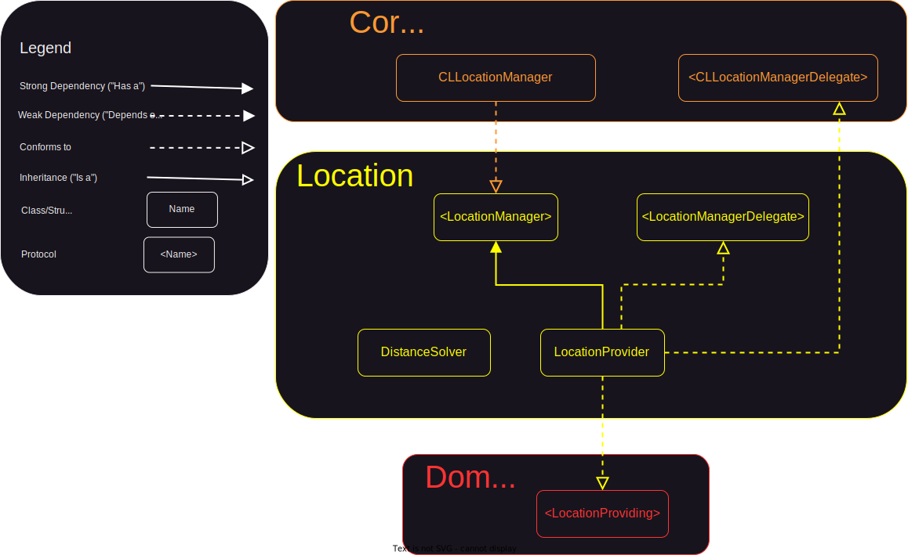

# Foodybite

## Motivation

## Architecture


Modules:
- [Shared API](#shared-api)
- [Networking](#networking)
- [Places](#places)
- [Persistence](#persistence)
- [Location](#location)
- [Domain](#domain)
- [Presentation](#presentation)
- [UI](#ui)
- [Main](#main)

### Shared API


### Networking
The following diagram represents the networking layer talking with my backend app. For a better understanding, I will explain each major section of the diagram and decisions made during testing (all components were tested using TDD):
1. [Refresh Token Strategy](#1-refresh-token-strategy)
2. [Network Request Flow](#2-network-request-flow)
3. [Endpoint Creation](#3-endpoint-creation)
4. [Mock Network Requests](#4-mock-network-requests)
5. [Testing `Data` to `Decodable` Mapping](#5-testing-data-to-decodable-mapping)


| Component | Responsibility |
|------|------|
| KeychainTokenStore | Performs read/write operations from/to Keychain on AuthToken |
| RefreshTokenService | Fetches new `AuthToken` from server and stores it in `TokenStore` |
| RefreshTokenEndpoint | Creates `URLRequest` for generating new access and refresh tokens |
| AuthToken | Struct containing accessToken and refreshToken |
| AuthenticatedURLSessionHTTPClient | Decorator over `HTTPClient` that adds authentication capabilities to the client |
| RemoteStore | Validates the response from `HTTPClient` and parses the data |
| APIService | Creates the endpoints and sends them to the `ResourceLoader` or `ResourceSender` |
| LoginEndpoint | Creates `URLRequest` for authentication |
| SignUpEndpoint | Creates `URLRequest` for creating an account |
| AccountEndpoint | Creates `URLRequest` for updating the current account or delete it |
| LogoutEndpoint | Creates `URLRequest` for ending the current session |
| ChangePasswordEndpoint | Creates `URLRequest` for changing the password |
| ReviewEndpoint | Creates `URLRequest` for adding a review or getting all reviews for a particular restaurant |

#### 1. Refresh Token Strategy


#### 2. Network Request Flow

This flow is composed by 3 classes: 
- `APIService`, which implements domain protocols, creates `URLRequest` objects from endpoints and sends them to the remote store.
- `RemoteStore`, which implements `ResourceLoader` and `ResourceSender`, validates the status code returned by the client and parses received data.
- `AuthenticatedURLSessionHTTPClient`, which implements `HTTPClient`, signs each request using the access token fetched using an `TokenRefresher` collaborator (You can find more details about refresh token strategy [here](#1-refresh-token-strategy)). In the `Composition Root` this class is used only for requests that require authentication, otherwise an instance of `URLSessionHTTPClient` from the `SharedAPI` module is used.


#### 3. Endpoint Creation

Initially, I created a single enum with individual cases for each request which conformed to the `Endpoint` protocol. It was a convenient choice because all requests available were grouped in a single file, but as I was adding more requests I realized that each time the same file is modified, thus breaking the `Open/Closed Principle` which states that the system should be open for extension, but closed for modification.

I immediately pivoted and extracted the related cases in separate enums with related cases, like it is the case for `AccountEndpoint` which has cases for `POST` and `DELETE`. 

```swift
enum AccountEndpoint: Endpoint {
    case post(UpdateAccountRequestBody)
    case delete
    
    var path: String {
        "/auth/account"
    }
    
    var method: RequestMethod {
        switch self {
        case .delete:
            return .delete
        case .post:
            return .post
        }
    }
    
    var body: Encodable? {
        switch self {
        case let .post(updateAccountBody):
            return updateAccountBody
        case .delete:
            return nil
        }
    }
}
```

Otherwise, if a case is not related any other case then I extracted it in a struct with the body as the instance property.

```swift
struct LoginEndpoint: Endpoint {
    private let requestBody: LoginRequestBody
    
    init(requestBody: LoginRequestBody) {
        self.requestBody = requestBody
    }

    var path: String {
        "/auth/login"
    }
    
    var method: RequestMethod {
        .post
    }
    
    var body: Encodable? {
        requestBody
    }
}
```
Currently, when the need to add another endpoint arises, I can create another struct which conforms to `Endpoint` or edit a file containing related endpoints to the one I want to add (this case still violates the principle, but considering the relatedness of the endpoints I think it's a good trade-off for now).

#### 4. Mock Network Requests

I prefer not to hit the network while testing the `URLSessionHTTPClient`. In my experience, there are 3 ways to mock a network request which uses `URLSession`:

1. By creating a spy/stub class for `URLSession`, overriding the following method to return stubbed data or capturing the parameters.

```swift
func data(for request: URLRequest, delegate: URLSessionTaskDelegate?) async throws -> (Data, URLResponse)
```

> 🚩 There are a lot more methods in the 𝐔𝐑𝐋𝐒𝐞𝐬𝐬𝐢𝐨𝐧 class that we don't control and by subclassing we assume the behaviour of the overridden method is not depending on other methods.

2. By creating a protocol with only the method we are interested in mocking and making `URLSession` conform to it. Furthermore, we can implement our spy/stub using the protocol.

```swift
public protocol URLSessionProtocol {
    func data(for request: URLRequest, delegate: URLSessionTaskDelegate?) async throws -> (Data, URLResponse)
}

extension URLSession: URLSessionProtocol {}
```

> 🚩 The need to create the protocol in production for the sole purpose of testing because it's not an abstraction meant to be used by other clients.

3. By subclassing `URLProtocol` and overriding a couple of methods to intercept the requests. Also, the stub should be registered by calling `URLProtocol.registerClass(URLProtocolStub.self)` to be used by the `URL Loading System`.

✅ For this project, I opted out to use the third option as it's the most reliable and it doesn't require to create additional files only for testing, thus cluterring the production side.

#### 5. Testing `Data` to `Decodable` Mapping

For testing the mapping from `Data` to `Decodable` I chose to test it directly in the `RemoteStore`, hiding the knowledge of a collaborator (in this case `CodableDataParser`). While I could do this using a stubbed collaborator (e.g. a protocol `DataParser`), I prefered to test in integration the mapping, resulting in less complexity and less coupling of tests with the production code.

### Places

The following diagram presents the `Places` module which has as a dependency `Shared API` because it shares the need to fetch resources over the network with the `Networking` module. This module calls [`Google Places APIs`](https://developers.google.com/maps/documentation/places/web-service/overview) and I chose to keep it in a separate module to respect the `Single Responsibility Principle` by isolating the requests to my server from the ones to `Google Places`.


| Component | Responsibility |
|------|------|
| RemoteLoader | Validates the response from `HTTPClient` and parses the data or returns it directly |
| PlacesService | Creates the endpoints and sends them to the `ResourceLoader` or `DataLoader` |
| SearchNearbyEndpoint | Creates `URLRequest` for searching nearby restaurants |
| GetPlaceDetailsEndpoint | Creates `URLRequest` for getting detailed information about a particular restaurant |
| GetPlacePhotoEndpoint | Creates `URLRequest` for fetching image data using a photo reference |
| AutocompleteEndpoint | Creates `URLRequest` for searching restaurants given an input, location and radius |

### Persistence

The following diagram presents the `Persistence` module, highlights the [infrastructure](#infrastructure) to [cache domain models](#cache-domain-models) in `CoreData`. Additionaly, it has the capability to [store `UserPreferences`](#store-user-preferences) locally in `UserDefaults`. 


| Component | Responsibility |
|------|------|
| LocalUserPreferences | Local representation of `UserPreferences` |
| UserPreferencesLocalStore | Uses `UserDefaults` to store and retrieve `UserPreferences` models |
| UserDAO | Uses `LocalStore` to save or retrieve a user |
| SearchNearbyDAO | Uses `LocalStore` to save or retrieve nearby places |
| GetPlaceDetailsDAO | Uses `LocalStore` to save or retrieve place details |
| CoreDataLocalStore | CoreData implementation of `LocalStore` that writes or reads objects which conforms to `LocalModelConvertable` |
| LocalModelConvertable | Generic protocol that creates a one-to-one relationship between a domain model and a managed model (local) |

#### Cache Domain Models

To increase the maintainability of the system, I decoupled the use cases from the implementation details by using the `Dependency Inversion` technique, creating the `LocalStore` protocol and making the concrete implementation of the local store to satisfy the use cases requirements (all the `DAO` classes). This helps to achieve a better separation of concerns (not exposing managed object contexts or entities as parameters) and allows the replacement of the infrastructure implementation without affecting other components. Thus, if I have the need in the future to replace `CoreData` with other caching framework like `Realm` or have just an in-memory cache, it would be fairly simple. Additionally, in case of new requirements coming in, I'm not concerning myself with how the actual store works inside as long as the `LocalStore` protocol satisfy my needs for the requirements.

For my current use cases, I only need to write/read one object or more from the local store.

```swift
public protocol LocalStore {
    func read<T: LocalModelConvertable>() async throws -> T
    func readAll<T: LocalModelConvertable>() async throws -> [T]
    func write<T: LocalModelConvertable>(_ object: T) async throws
    func writeAll<T: LocalModelConvertable>(_ objects: [T]) async throws
}
```

#### Infrastructure

Initially, I needed to cache only the `User` model for the autologin feature. In order to save users in the `CoreData` store an `NSManagedObject` is required. So, I had two options:
1. Make the domain model inherit `NSManagedObject`

| Advantages | Disadvantages |
|------|------|
| It's really convenient to convert the `User` domain model in a `NSManagedObject` | All modules that depend on `Domain` would depend on an implementation detail of the `Persistence` module, thus coupling the business logic with a specific framework (leaking framework details) |
| | It increases the number of components that depends on the domain model making an eventual change to it expensive, as it can potentially break many modules |
| | All the following decisions would be made by trying to accomodate the coupling with CoreData |

2. Create a distinct representation of an user model specific for CoreData

| Advantages | Disadvantages |
|------|------|
| It increases modularity by hiding the implementation details for the `CoreData` store | Requires creating another model, also mapping back and forth from the domain model |
| It's not forcing the domain model to contain properties relevant only for persistence (e.g. relationships) | |
| Working with structs (immutable data) can be easier to comprehend than with classes (mutable references) | |

Since I wanted to hide all implementation details related to persistence, maintain modularity and decrease the coupling of domain models with a framework specific, I chose to create a separate managed model corresponding to the `User` domain model.

After deciding to create distinct representation for all domain models, I needed a way to create an one-to-one relationship between a domain model and a managed model. The best approach I could find was to create a generic protocol, for domain models to implement, that has the requirements for mapping back and forth.

```swift
public protocol LocalModelConvertable {
    associatedtype LocalModel: NSManagedObject
    
    init(from: LocalModel)
    func toLocalModel(context: NSManagedObjectContext) -> LocalModel
}
```

The initial goal was to create a generic boundary for the concrete implementation to use the same store for all domain models, that's why the `LocalStore` has generic methods dependent on types that must conform to `LocalModelConvertable`. Also, the mapping is done in the concrete implementation (`CoreDataLocalStore`) which respects the `Open/Closed Principle` since adding a new managed model doesn't require any change in the concrete store, but only creating the managed model and conforming the domain model to the `LocalModelConvertable` to create the relationship between them. The following code block is an example for the `User` model:

```swift
extension User: LocalModelConvertable {
    public init(from managedUser: ManagedUser) {
        self.init(id: managedUser.id,
                  name: managedUser.name,
                  email: managedUser.email,
                  profileImage: managedUser.profileImage)
    }
    
    public func toLocalModel(context: NSManagedObjectContext) -> ManagedUser {
        ManagedUser(self, for: context)
    }
}
```

#### Store User Preferences

I chose to create a local representation of the user preferences locally to hide the `Codable` dependency from the domain model and hide all the complexity that can come with it. It's the same reasoning as for the `CoreData` local store above (hiding implementation details because clients don't care how the data is actually stored). This gives me the flexibility to change the actual implementation to better fit the new requirements (maybe moving user preferences in a `CoreData` store or choosing other way of persisting data).

### Location

The following diagram presents the `Location` module and how it interacts with `CoreLocation`.

In this module, I chose to switch from the classic delegation pattern of getting the current location to the `async/await` approach using a continuation (You can find more details about it here: [From delegation to async/await](#from-delegation-to-asyncawait)).

Another interesting topic related to this module is how I was able to use TDD to get the current location using `CLLocationManager` and `CLLocationManagerDelegate`. (More details here: [Get current location using TDD](#get-current-location-using-tdd))



| Component | Responsibility |
|------|------|
| LocationProvider | Fetches user's current location |
| DistanceSolver | Computes distance between two locations |

#### From delegation to async/await

Since all modules use the `async/await` concurrency module I needed to switch from the usual delegation pattern that `CoreLocation` uses to advertise the current location.

I was able to do it by using a continuation which I capture in the `requestLocation` method in `LocationProvider` only if the user previously authorized the use of location. Afterwards, I make the request for a single location to the location manager.

```swift
public func requestLocation() async throws -> Location {
    guard locationServicesEnabled else {
        throw LocationError.locationServicesDisabled
    }
    
    return try await withCheckedThrowingContinuation { continuation in
        self.continuation = continuation
        locationManager.requestLocation()
    }
}
```

At this moment, we need to wait a delegate method to be triggered to resume the continuation either with an error or with a location.

```swift
public func locationManager(manager: LocationManager, didFailWithError error: Error) {
    continuation?.resume(throwing: error)
    continuation = nil
}

public func locationManager(manager: LocationManager, didUpdateLocations locations: [CLLocation]) {
    if let firstLocation = locations.first {
        let location = Location(
            latitude: firstLocation.coordinate.latitude,
            longitude: firstLocation.coordinate.longitude
        )
        continuation?.resume(returning: location)
        continuation = nil
    }
}
```

> ❗️ Resuming a continuation must be made exactly once. Otherwise, it results in undefined behaviour, that's why I set it to nil after each resume call, to prevent calling it on the same instance again. Not calling it leaves the task in a suspended state indefinitely. (Apple docs: [CheckedContinuation](https://developer.apple.com/documentation/swift/checkedcontinuation))

#### Get current location using TDD

To effectively test the behaviour of the `LocationProvider` in isolation I needed to decouple it from `CoreLocation`. I had quickly written an experimental class (without commiting it) to see what location features I needed and how the component would interact with `CoreLocation` before I deleted it and started the TDD process.

During the experimentation, I realised that I needed a way to mock the behaviour of the `CLLocationManager` class in order to spy certain behaviours (e.g. `requestLocation()`) or stub properties (e.g. `authorizationStatus`). Another reason for this is that `CoreLocation` requires user authorization which can trigger a permission dialog on the device if it wasn't granted before, making the tests relying on device state and causing them to be less maintainable and more likely to fail.

A common practice in this case is to extract a protocol with properties and methods from the target class, in this case `CLLocationManager`, that I was interested in mocking during testing. You can see below the minimal protocol for requesting the user's authorization and the current location.

```swift
public protocol LocationManager {
    var locationDelegate: LocationManagerDelegate? { get set }
    var authorizationStatus: CLAuthorizationStatus { get }

    func requestWhenInUseAuthorization()
    func requestLocation()
}

```
Next, I used an extension to make `CLLocationManager` conform to this protocol, allowing me to use the protocol instead of the concrete implementation of the location manager in production.

```swift
extension CLLocationManager: LocationManager {}
```

On the other hand, I could use it to create a spy for this collaborator to test how it interacts with the SUT by spying methods or stubbing properties.

```swift
private class LocationManagerSpy: LocationManager {
    var delegate: CLLocationManagerDelegate?
    var authorizationStatus: CLAuthorizationStatus = .notDetermined
    
    var requestWhenInUseAuthorizationCallCount = 0
    var requestLocationCallCount = 0
    
    func requestWhenInUseAuthorization() {
        requestWhenInUseAuthorizationCallCount += 1
    }
    
    func requestLocation() {
        requestLocationCallCount += 1
    }
}
```

I needed to decouple the code from the other external dependency, `CLLocationManagerDelegate`,  by creating a protocol that mimicks it, but uses the protocol for the manager defined above.

```swift
public protocol LocationManagerDelegate: AnyObject {
    func locationManagerDidChangeAuthorization(manager: LocationManager)
    func locationManager(manager: LocationManager, didFailWithError error: Error)
    func locationManager(manager: LocationManager, didUpdateLocations locations: [CLLocation])
}
```

`LocationProvider` needs to conform to this new protocol and implement the logic required for fetching the current location. Additionally, it still needs to conform to `CLLocationManagerDelegate` because the concrete implementation, `CLLocationManager`, is not aware of the `LocationManagerDelegate` existence, but those methods only need to call their equivalent method.

```swift
extension LocationProvider: LocationManagerDelegate  {
    public func locationManagerDidChangeAuthorization(manager: LocationManager) {
        // some more code
    }
    
    public func locationManager(manager: LocationManager, didFailWithError error: Error) {
        // some more code
    }
    
    public func locationManager(manager: LocationManager, didUpdateLocations locations: [CLLocation]) {
        // some more code
    }
}

extension LocationProvider: CLLocationManagerDelegate {
    public func locationManagerDidChangeAuthorization(_ manager: CLLocationManager) {
        locationManagerDidChangeAuthorization(manager: manager)
    }
    
    public func locationManager(_ manager: CLLocationManager, didFailWithError error: Error) {
        locationManager(manager: manager, didFailWithError: error)
    }
    
    public func locationManager(_ manager: CLLocationManager, didUpdateLocations locations: [CLLocation]) {
        locationManager(manager: manager, didUpdateLocations: locations)
    }
}
```

### Domain

#### User Session Feature

Model: [User](./Domain/Models/User/User.swift)
```swift
public struct User: Equatable {
    public let id: UUID
    public let name: String
    public let email: String
    public let profileImage: Data?
    
    public init(id: UUID, name: String, email: String, profileImage: Data?) {
        self.id = id
        self.name = name
        self.email = email
        self.profileImage = profileImage
    }
}
```

Protocols:
1. SignUpService
```swift
public protocol SignUpService {
    func signUp(name: String, email: String, password: String, confirmPassword: String, profileImage: Data?) async throws
}
```

2. LoginService
```swift
public protocol LoginService {
    func login(email: String, password: String) async throws -> User
}
```

3. LogoutService
```swift
public protocol LogoutService {
    func logout() async throws
}
```

#### Update/Delete Account Feature

Protocols:
1. AccountService
```swift
public protocol AccountService {
    func updateAccount(name: String, email: String, profileImage: Data?) async throws
    func deleteAccount() async throws
}
```

2. ChangePasswordService
```swift
public protocol ChangePasswordService {
    func changePassword(currentPassword: String, newPassword: String, confirmPassword: String) async throws
}
```

#### Store/Retrieve User Preferences Feature

Domain Model: UserPreferences
```swift
public struct UserPreferences: Equatable {
    public let radius: Int
    public let starsNumber: Int
    
    public static let `default` = UserPreferences(radius: 10_000, starsNumber: 0)
    
    public init(radius: Int, starsNumber: Int) {
        self.radius = radius
        self.starsNumber = starsNumber
    }
}
```

Protocols:
1. UserPreferencesSaver
```swift
public protocol UserPreferencesSaver {
    func save(_ userPreferences: UserPreferences)
}
```

2. UserPreferencesLoader
```swift
public protocol UserPreferencesLoader {
    func load() -> UserPreferences
}
```

#### Add Review Feature

Domain Model: Review
```swift
public struct Review: Equatable, Identifiable, Hashable {
    public var id: UUID
    public let placeID: String
    public let profileImageURL: URL?
    public let profileImageData: Data?
    public let authorName: String
    public let reviewText: String
    public let rating: Int
    public let relativeTime: String
}
```

Protocol: AddReviewService
```swift
public protocol AddReviewService {
    func addReview(placeID: String, reviewText: String, starsNumber: Int, createdAt: Date) async throws
}
```

#### Get Reviews Feature

Domain Model (same `Review` model as for `Add Review Feature`)

Protocol: GetReviewsService
```swift
public protocol GetReviewsService {
    func getReviews(placeID: String?) async throws -> [Review]
}
```

#### Search Nearby Feature

Domain Models:
1. NearbyPlace
```swift
public struct NearbyPlace: Equatable {
    public let placeID: String
    public let placeName: String
    public let isOpen: Bool
    public let rating: Double
    public let location: Location
    public let photo: Photo?
}
```

2. Location
```swift
public struct Location: Equatable, Hashable {
    public let latitude: Double
    public let longitude: Double
}
```

3. Photo
```swift
public struct Photo: Equatable, Hashable {
    public let width: Int
    public let height: Int
    public let photoReference: String
}
```

Protocol: SearchNearbyService
```swift
public protocol SearchNearbyService {
    func searchNearby(location: Location, radius: Int) async throws -> [NearbyPlace]
}
```

#### Get Place Details Feature

Domain Models:
1. PlaceDetails
```swift
public struct PlaceDetails: Equatable, Hashable {
    public let placeID: String
    public let phoneNumber: String?
    public let name: String
    public let address: String
    public let rating: Double
    public let openingHoursDetails: OpeningHoursDetails?
    public var reviews: [Review]
    public let location: Location
    public let photos: [Photo]
}
```

2. OpeningHoursDetails
```swift
public struct OpeningHoursDetails: Equatable, Hashable {
    public let openNow: Bool
    public let weekdayText: [String]
}
```

3. Review (same model as for `Add Review Feature`)

Protocol: GetPlaceDetailsService
```swift
public protocol GetPlaceDetailsService {
    func getPlaceDetails(placeID: String) async throws -> PlaceDetails
}
```

#### Fetch Place Photo Feature

Domain Model (same `Photo` model as for `Search Nearby Feature`)

Protocol: FetchPlacePhotoService
```swift
public protocol FetchPlacePhotoService {
    func fetchPlacePhoto(photoReference: String) async throws -> Data
}
```

#### Autocomplete Feature (Search Places)

Domain Model: AutocompletePrediction
```swift
public struct AutocompletePrediction: Equatable {
    public let placePrediction: String
    public let placeID: String
}
```

Protocol: AutocompletePlacesService
```swift
public protocol AutocompletePlacesService {
    func autocomplete(input: String, location: Location, radius: Int) async throws -> [AutocompletePrediction]
}
```

#### Get Current Location Feature

Domain Model (same `Location` model as for `Search Nearby Feature`)

Protocol: LocationProviding
```swift
public protocol LocationProviding {
    var locationServicesEnabled: Bool { get }
    
    func requestLocation() async throws -> Location
}
```

#### Cache Reviews Feature

Domain Model (same `Review` model as for `Add Review Feature`)

Protocol: ReviewCache
```swift
public protocol ReviewCache {
    func save(reviews: [Review]) async throws
}
```

#### Cache Nearby Places Feature

Domain Model (same `NearbyPlace` model as for `Search Nearby Feature`)

Protocol: SearchNearbyCache
```swift
public protocol SearchNearbyCache {
    func save(nearbyPlaces: [NearbyPlace]) async throws
}
```

#### Cache Place Details Feature

Domain Model (same `PlaceDetails` model as for `Get Place Details Feature`)

Protocol: PlaceDetailsCache
```swift
public protocol PlaceDetailsCache {
    func save(placeDetails: PlaceDetails) async throws
}
```

### Presentation

### UI


### Main

## Testing

During the entire project I've used TDD as the development process (excluding the UI layer) by following the feedback loop.

I've been using TDD for over a year now and I really like it because it helps me to break down tasks and solve one problem at a time. Also, I find it interesting how the design evolves naturally when using TDD. Additionally, it helped me understand better what I was trying to build before writing code while increasing my confidence in the correctness of the system afterwards.


### Unit Tests

I used unit tests as the foundation for my testing pyramid because they are the most reliable and cheap to write. Also, I can easily test each component in isolation by mocking collaborators without making any assumptions about the rest of the system.

### Snapshots Tests

### Integration Tests

Furthermore, I used end-to-end tests to check the connection with the backend APIs (my backend and Google Places API) to validate actual communication between the backends and the app. On top of that, I used cache integration tests to validate that the local storage works as expected given multiple instances.

#### End-to-End Tests

I used an `URLSession` with ephemeral configuration for both my own server and `Google Places API` not to cache the successful requests as the default behaviour of the `URLSession` is to cache the requests using `URLCache`. By disabling caching, I avoid the posibility of passing the tests while the network is not reachable because the cached request was returned. This way, I reduce the risk of flaky and unreliable.

#### Cache Integration Tests

An important aspect while testing different systems in integration is to take into consideration the potential artifacts that can be created during testing. It's important to mention here that I delete the store before and after each tests using the `setUp` and `tearDown` methods to ensure that each test have a clean state before running. That's why I chose to inject the store URL in the `CoreDataLocalStore` to dynamically create a separate path when testing based on the test filename.

## Metrics

