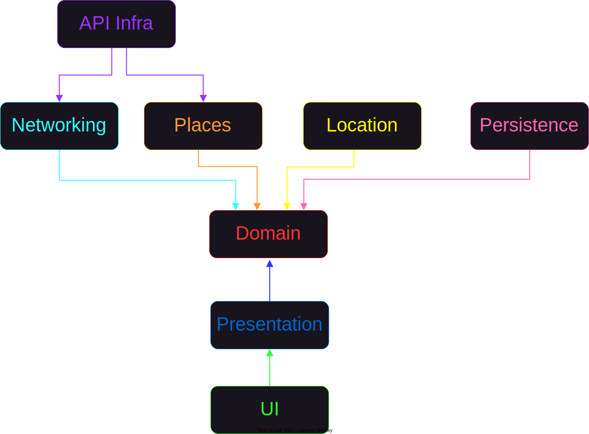
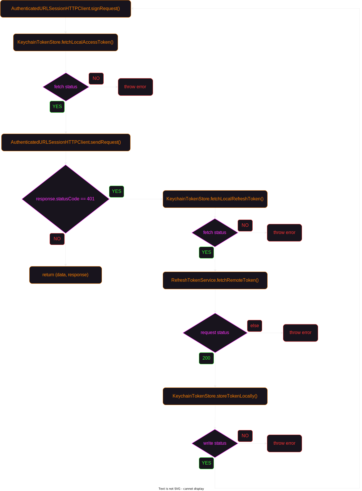
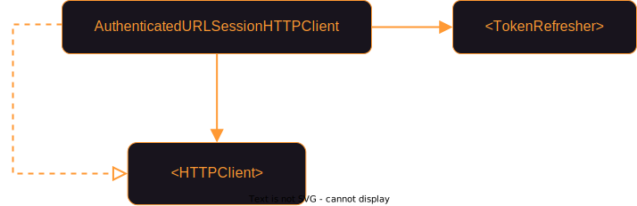
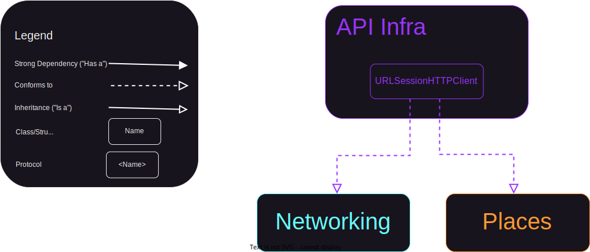
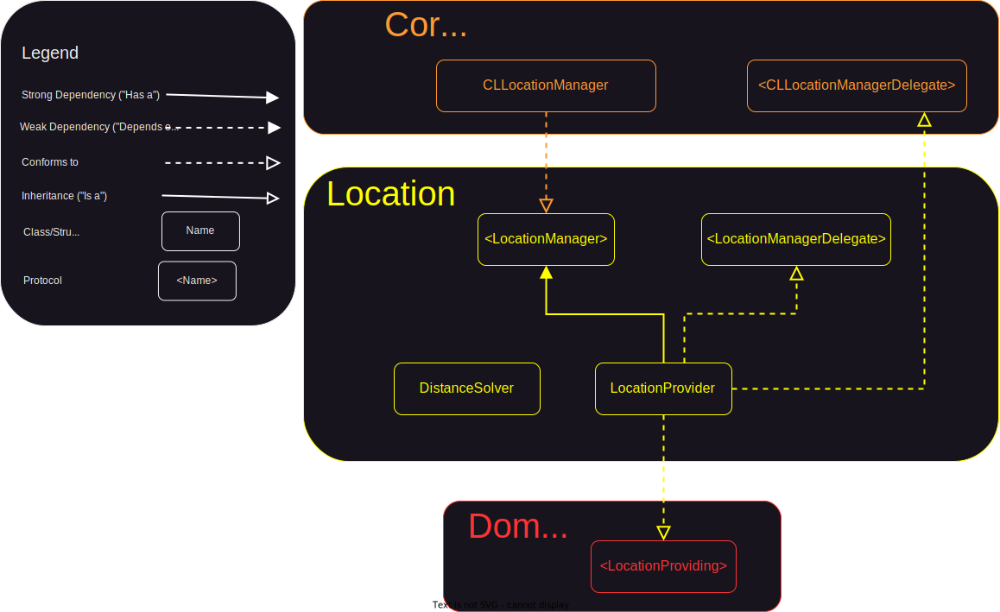
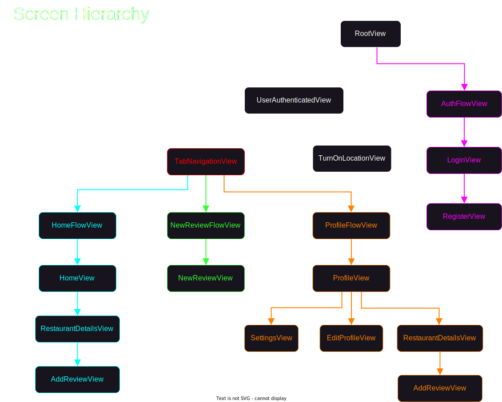

## Architecture

### Overview

For this project, I organized the codebase into independent frameworks, using `horizontal slicing` to break down the app into layers, respecting the dependency rule:

> ❗️ High-level modules should not depend on lower-level modules and lower-level modules should only communicate and know about the next higher-level layer.

In my opinion, it's the best approach for this kind of project since `vertical slicing` is more suitable for larger projects with feature teams. Also, the number of features isn't high enough to make the layers bloated with an excessive number of classes and become unmanageable.

The following diagram provides a top-level view with all modules from this project along with their dependencies on other modules:
1. [Domain](#domain)
2. [Networking](#networking)
3. [Places](#places)
4. [API Infra](#api-infra)
5. [Persistence](#persistence)
6. [Location](#location)
7. [Presentation](#presentation)
8. [UI](#ui)
9. [Main](#main) (Composition Root)



### Domain

The domain represents the innermost layer in the architecture (no dependencies with other layers). It contains only models and abstractions for:
- fetching or saving data implemented by the [Networking](#networking), [Places](#places), and [Persistence](#persistence) modules
- providing the current location implemented by the [Location](#location) module
- the [Presentation](#presentation) module to obtain relevant data and convert it to the format required by the [UI](#ui) module

#### 1. User Session Feature

```swift
public struct User: Equatable {
    public let id: UUID
    public let name: String
    public let email: String
    public let profileImage: Data?
    
    public init(id: UUID, name: String, email: String, profileImage: Data?) {
        self.id = id
        self.name = name
        self.email = email
        self.profileImage = profileImage
    }
}
```

```swift
public protocol SignUpService {
    func signUp(name: String, email: String, password: String, confirmPassword: String, profileImage: Data?) async throws
}

public protocol LoginService {
    func login(email: String, password: String) async throws -> User
}

public protocol LogoutService {
    func logout() async throws
}
```

#### 2. Update/Delete Account Feature

```swift
public protocol AccountService {
    func updateAccount(name: String, email: String, profileImage: Data?) async throws
    func deleteAccount() async throws
}

public protocol ChangePasswordService {
    func changePassword(currentPassword: String, newPassword: String, confirmPassword: String) async throws
}
```

#### 3. Store/Retrieve User Preferences Feature

```swift
public struct UserPreferences: Equatable {
    public let radius: Int
    public let starsNumber: Int
    
    public static let `default` = UserPreferences(radius: 10_000, starsNumber: 0)
    
    public init(radius: Int, starsNumber: Int) {
        self.radius = radius
        self.starsNumber = starsNumber
    }
}
```

```swift
public protocol UserPreferencesSaver {
    func save(_ userPreferences: UserPreferences)
}

public protocol UserPreferencesLoader {
    func load() -> UserPreferences
}
```

#### 4. Nearby Restaurants Feature

```swift
public struct NearbyRestaurant: Equatable {
    public let id: String
    public let name: String
    public let isOpen: Bool
    public let rating: Double
    public let location: Location
    public let photo: Photo?
}

public struct Location: Equatable, Hashable {
    public let latitude: Double
    public let longitude: Double
}
```

```swift
public protocol NearbyRestaurantsService {
    func searchNearby(location: Location, radius: Int) async throws -> [NearbyRestaurant]
}

public protocol NearbyRestaurantsCache {
    func save(nearbyRestaurants: [NearbyRestaurant]) async throws
}
```

#### 5. Fetch Restaurant Photo Feature

```swift
public struct Photo: Equatable, Hashable {
    public let width: Int
    public let height: Int
    public let photoReference: String
}
```

```swift
public protocol RestaurantPhotoService {
    func fetchPhoto(photoReference: String) async throws -> Data
}
```

#### 6. Restaurant Details Feature

```swift
public struct RestaurantDetails: Equatable, Hashable {
    public let id: String
    public let phoneNumber: String?
    public let name: String
    public let address: String
    public let rating: Double
    public let openingHoursDetails: OpeningHoursDetails?
    public var reviews: [Review]
    public let location: Location
    public let photos: [Photo]
}

public struct OpeningHoursDetails: Equatable, Hashable {
    public let openNow: Bool
    public let weekdayText: [String]
}

public struct Review: Equatable, Identifiable, Hashable {
    public var id: UUID
    public let restaurantID: String
    public let profileImageURL: URL?
    public let profileImageData: Data?
    public let authorName: String
    public let reviewText: String
    public let rating: Int
    public let relativeTime: String
}
```

```swift
public protocol RestaurantDetailsService {
    func getRestaurantDetails(restaurantID: String) async throws -> RestaurantDetails
}

public protocol RestaurantDetailsCache {
    func save(restaurantDetails: RestaurantDetails) async throws
}
```

#### 7. Autocomplete Restaurants Feature

```swift
public struct AutocompletePrediction: Hashable {
    public let restaurantPrediction: String
    public let restaurantID: String
}
```

```swift
public protocol AutocompleteRestaurantsService {
    func autocomplete(input: String, location: Location, radius: Int) async throws -> [AutocompletePrediction]
}
```

#### 8. Add Review Feature

```swift
public struct Review: Equatable, Identifiable, Hashable {
    public var id: UUID
    public let restaurantID: String
    public let profileImageURL: URL?
    public let profileImageData: Data?
    public let authorName: String
    public let reviewText: String
    public let rating: Int
    public let relativeTime: String
}
```

```swift
public protocol AddReviewService {
    func addReview(restaurantID: String, reviewText: String, starsNumber: Int, createdAt: Date) async throws
}
```

#### 9. Get Reviews Feature

```swift
public struct Review: Equatable, Identifiable, Hashable {
    public var id: UUID
    public let restaurantID: String
    public let profileImageURL: URL?
    public let profileImageData: Data?
    public let authorName: String
    public let reviewText: String
    public let rating: Int
    public let relativeTime: String
}
```

```swift
public protocol GetReviewsService {
    func getReviews(restaurantID: String?) async throws -> [Review]
}

public protocol ReviewCache {
    func save(reviews: [Review]) async throws
}
```

#### 10. Location Feature

```swift
public struct Location: Equatable, Hashable {
    public let latitude: Double
    public let longitude: Double
}
```

```swift
public protocol LocationProviding {
    var locationServicesEnabled: Bool { get }
    
    func requestWhenInUseAuthorization()
    func requestLocation() async throws -> Location
}
```

### Networking
The following diagram showcases the networking layer, which communicates with my backend app. For a better understanding, I will elaborate each major section of the diagram and decisions made during testing:
1. [Refresh Token Strategy](#1-refresh-token-strategy)
2. [Network Request Flow](#2-network-request-flow)
3. [Endpoint Creation](#3-endpoint-creation)
4. [Testing `Data` to `Decodable` Mapping](#4-testing-data-to-decodable-mapping)
5. [Parsing JSON Response](#5-parsing-json-response)


| Component | Responsibility |
|------|------|
| KeychainTokenStore | Performs read/write operations from/to Keychain on AuthToken |
| RefreshTokenService | Fetches new `AuthToken` from server and stores it in `TokenStore` |
| RefreshTokenEndpoint | Creates `URLRequest` for generating new access and refresh tokens |
| AuthToken | Struct containing accessToken and refreshToken |
| AuthenticatedURLSessionHTTPClient | Decorator over `HTTPClient` that adds authentication capability to the client |
| RemoteStore | Validates the response from `HTTPClient` and parses the data |
| APIService | Creates the endpoints and sends them to the `ResourceLoader` or `ResourceSender` |
| LoginEndpoint | Creates `URLRequest` for authentication |
| SignUpEndpoint | Creates `URLRequest` for creating an account |
| AccountEndpoint | Creates `URLRequest` for updating the current account or deleting it |
| LogoutEndpoint | Creates `URLRequest` for ending the current session |
| ChangePasswordEndpoint | Creates `URLRequest` for changing the password |
| ReviewEndpoint | Creates `URLRequest` for adding a review or getting all reviews for a particular restaurant |

#### 1. Refresh Token Strategy

The following diagram outlines the entire state machine of making requests that require authentication.



In order to avoid making multiple `refreshTokens` requests in parallel, I stored the first task in an instance property. The first request creates the task and the following requests are just waiting for the task value (in this case, the value is `Void`, so they only waits for the completion of the task).

```swift
public func fetchLocallyRemoteToken() async throws {
    if let refreshTask = refreshTask {
        return try await refreshTask.value
    }
    
    let urlRequest = try createURLRequest()
    
    let task: Task<Void, Error> = Task {
        let remoteAuthToken: AuthToken = try await loader.get(for: urlRequest)
        try tokenStore.write(remoteAuthToken)
        
        refreshTask = nil
    }
    
    refreshTask = task
    try await task.value
}
```

To validate that only one request is actually made when multiple requests are triggered in parallel, I utilized a `TaskGroup` to simulate this behaviour and ensure that all subsequent requests received the token stored by the first request.

```swift
func test_fetchLocallyRemoteToken_makesRefreshTokenRequestOnlyOnceWhenCalledMultipleTimesInParallel() async throws {
    let (sut, loaderSpy, _) = makeSUT(authToken: makeRemoteAuthToken())
    
    await requestRemoteAuthTokenInParallel(on: sut, numberOfRequests: 10)
    
    XCTAssertEqual(loaderSpy.requests.count, 1)
}

private func requestRemoteAuthTokenInParallel(on sut: TokenRefresher, numberOfRequests: Int) async {
    await withThrowingTaskGroup(of: Void.self) { group in
        (0..<numberOfRequests).forEach { _ in
            group.addTask {
                try await sut.fetchLocallyRemoteToken()
            }
        }
    }
}
```

Additionally, to prevent potential race conditions that can occur while mutating the `refreshTask` instance property from different threads, I decided to implement the `RefreshTokenService` as an actor. Also, the actor is instantiated in the composition root only once (singleton lifetime), preventing multiple instances to make concurrent `refreshTokens` requests.

```swift
public actor RefreshTokenService: TokenRefresher {
    private let loader: ResourceLoader
    private let tokenStore: TokenStore
    private var refreshTask: Task<Void, Error>?
    ...
}
```

#### 2. Network Request Flow

This flow is composed by 3 classes: 
- `APIService`, which implements domain protocols, creates `URLRequest` objects from endpoints and sends them to the remote store.
- `RemoteStore`, which implements `ResourceLoader` and `ResourceSender`, validates the status code returned by the client and parses received data.
- `AuthenticatedURLSessionHTTPClient`, which decorates `HTTPClient`, signs each request with an access token fetched using an `TokenRefresher` collaborator (You can find more details about refresh token strategy [here](#1-refresh-token-strategy)). In the `Composition Root`, this class is used only for requests that require authentication, otherwise an instance of `URLSessionHTTPClient` from the `API Infra` module is used.



#### 3. Endpoint Creation

Initially, I created a single enum with individual cases for each request which conformed to the `Endpoint` protocol. It was a convenient choice because all requests available were grouped in a single file. However, as I was adding more requests, I recognised that each time the same file was modified, thus breaking the `Open/Closed Principle` which states that the system should be open for extension, but closed for modification.

I immediately pivoted and extracted the initial cases in separate enums with related requests, such as with the `AccountEndpoint` which has cases for `POST` and `DELETE`.

```swift
enum AccountEndpoint: Endpoint {
    case post(UpdateAccountRequestBody)
    case delete
    
    var path: String {
        "/auth/account"
    }
    
    var method: RequestMethod {
        switch self {
        case .delete:
            return .delete
        case .post:
            return .post
        }
    }
    
    var body: Encodable? {
        switch self {
        case let .post(updateAccountBody):
            return updateAccountBody
        case .delete:
            return nil
        }
    }
}
```

Otherwise, if a request is not related to any other requests, I extracted it into a separate struct with an instance property representing the body of the request.

```swift
struct LoginEndpoint: Endpoint {
    private let requestBody: LoginRequestBody
    
    init(requestBody: LoginRequestBody) {
        self.requestBody = requestBody
    }

    var path: String {
        "/auth/login"
    }
    
    var method: RequestMethod {
        .post
    }
    
    var body: Encodable? {
        requestBody
    }
}
```
Currently, when the need to add another endpoint arises, I can only create another struct which conforms to `Endpoint` or edit a file containing related endpoints to the one I want to add (this case still violates the principle, but considering the relatedness of the endpoints I think it's a good trade-off for now).

#### 4. Testing `Data` to `Decodable` Mapping

For testing the mapping from `Data` to `Decodable` I preferred to test it directly in the `RemoteStore`, hiding the knowledge of a collaborator (in this case `CodableDataParser`). While I could have accomplished this using a stubbed collaborator (e.g. a protocol `DataParser`), I prefered to test it in integration, resulting in lower complexity and coupling of tests with the production code.

#### 5. Parsing JSON Response

To parse the JSON received from the server I had two alternatives:
1. To make domain models conform to `Codable` and use them directly to decode the data
2. Create distinct representation for each domain model that needs to be parsed

I ended up choosing the second approach as I didn't want to leak the details of the concrete implementation outside of the module because it would reduce its encapsulation by letting other modules know how JSON parsing is performed.

### Places

The following diagram depicted below represents the `Places` module. This module has been designed to adhere to the `Single Responsibility Principle` by isolating the requests to my server from the ones that communicates with [`Google Places APIs`](https://developers.google.com/maps/documentation/places/web-service/overview).


| Component | Responsibility |
|------|------|
| RemoteLoader | Validates the response from `HTTPClient` and parses the data or returns it directly |
| PlacesService | Creates the endpoints and sends them to the `ResourceLoader` or `DataLoader` |
| SearchNearbyEndpoint | Creates `URLRequest` for searching nearby restaurants |
| GetRestaurantDetailsEndpoint | Creates `URLRequest` for getting detailed information about a particular restaurant |
| GetPlacePhotoEndpoint | Creates `URLRequest` for fetching image data using a photo reference |
| AutocompleteEndpoint | Creates `URLRequest` for searching restaurants given an input, location and radius |

#### Parsing JSON Response

The [same argument](#5-parsing-json-response) for the `Networking` module is also valid in this context. Additionally, I included in the DTOs all fields made available by the `Google Places API` for the convenience of checking easily what fields are available for each request to use them for developing the features without checking the documentation all the time.

### API Infra

The following diagram contains the concrete implementation of the `HTTPClient` protocol utilizing `URLSession`. It respects the dependency rule outlined in the overview section, as it solely depends on the `Networking` and `Places` modules. The decision to extract the infrastructure class in a separate module and compose them in the `Composition Root` was made due to the fact that both modules require to make network requests.



#### Mock Network Requests

It's not recommended to hit the network while testing the `URLSessionHTTPClient` in isolation. For checking the actual communication, I used [end-to-end tests](#end-to-end-tests) to validate the integration of the networking modules with the backend. In my experience, there are 3 methods to mock a network request which uses `URLSession`:

1. By creating a spy/stub class for `URLSession`, overriding the following method to return stubbed data or capturing the parameters.

```swift
func data(for request: URLRequest, delegate: URLSessionTaskDelegate?) async throws -> (Data, URLResponse)
```

> 🚩 There are many more methods in the `URLSession` class that we don't control and by subclassing we assume the behaviour of the overridden method is not depending on other methods.

2. By creating a protocol with only the method we are interested in mocking and making `URLSession` conform to it. Furthermore, we can implement our spy/stub using the protocol.

```swift
public protocol URLSessionProtocol {
    func data(for request: URLRequest, delegate: URLSessionTaskDelegate?) async throws -> (Data, URLResponse)
}

extension URLSession: URLSessionProtocol {}
```

> 🚩 The need to create the protocol in production for the sole purpose of testing because it's not an abstraction meant to be used by clients.

3. By subclassing `URLProtocol` and overriding several methods to intercept the requests. 


Also, the stub should be registered for the `URL Loading System` to use it by calling `URLProtocol.registerClass(URLProtocolStub.self)` or set it directly in the `protocolClasses` property of `URLSessionConfiguration` before instantiating the session. To instantiate `URLSessionHTTPClient` for testing, I utilized the following factory method:

```swift
private func makeSUT() -> URLSessionHTTPClient {
    let configuration = URLSessionConfiguration.ephemeral
    configuration.protocolClasses = [URLProtocolStub.self]
    let session = URLSession(configuration: configuration)
    let sut = URLSessionHTTPClient(session: session)
    return sut
}
```

For this project, I opted out to use the third option as it's the most reliable and doesn't require the creation of additional files exclusively for testing, thus cluttering the production side. I also use a struct to stub fake responses in the client and an array to spy on the incoming `URLRequests`. 

It's critical to remove the stub after each test not to influence the initial state of the other tests since the properties are static and shared between them. They are static because the `URLProtocolStub` can't be instantiated directly, as the system handles it internally. Thus, I don't have direct access to an instance, so I must use static properties to inject fake responses and spy the incoming requests.

```swift
class URLProtocolStub: URLProtocol {
    private struct Stub {
        let data: Data?
        let response: URLResponse?
        let error: Error?
    }
    
    private static var stub: Stub?
    private(set) static var capturedRequests = [URLRequest]()
    
    static func stub(data: Data?, response: URLResponse?, error: Error?) {
        stub = Stub(data: data, response: response, error: error)
    }
    
    static func removeStub() {
        stub = nil
        capturedRequests = []
    }
    
    override class func canInit(with request: URLRequest) -> Bool {
        capturedRequests.append(request)
        return true
    }
    
    override class func canonicalRequest(for request: URLRequest) -> URLRequest {
        return request
    }
    
    override func startLoading() {
        guard let stub = URLProtocolStub.stub else { return }
        
        if let data = stub.data {
            client?.urlProtocol(self, didLoad: data)
        }
        
        if let response = stub.response {
            client?.urlProtocol(self, didReceive: response, cacheStoragePolicy: .notAllowed)
        }
        
        if let error = stub.error {
            client?.urlProtocol(self, didFailWithError: error)
        } else {
            client?.urlProtocolDidFinishLoading(self)
        }
    }
    
    override func stopLoading() {}
}
```

### Persistence

The following diagram presents the `Persistence` module and highlights the [infrastructure](#infrastructure) to [cache domain models](#cache-domain-models) in `CoreData`. Additionaly, it has the capability to [store `UserPreferences`](#store-user-preferences) locally in `UserDefaults`. 


| Component | Responsibility |
|------|------|
| LocalUserPreferences | Local representation of `UserPreferences` |
| UserPreferencesLocalStore | Uses `UserDefaults` to store and retrieve `UserPreferences` models |
| UserDAO | Uses `LocalStore` to save or retrieve a user |
| NearbyRestaurantsDAO | Uses `LocalStore` to save or retrieve nearby restaurants |
| RestaurantDetailsDAO | Uses `LocalStore` to save or retrieve restaurant details |
| CoreDataLocalStore | `CoreData` implementation of `LocalStore` that writes or reads objects which conforms to `LocalModelConvertable` |
| LocalModelConvertable | Generic protocol that creates a one-to-one relationship between a domain and managed model |

#### Cache Domain Models

To enhance the system's maintainability, I decoupled the use cases from the implementation details by applying the `Dependency Inversion` technique, creating the `LocalStore` protocol and making the concrete implementation of the local store to satisfy the use cases requirements (all the `DAO` classes). 

This helps to achieve a better separation of concerns (not exposing managed object contexts or entities as parameters) and allows the replacement of the infrastructure implementation without affecting other components. Thus, if I have the need to replace `CoreData` in the future with other persistence frameworks like `Realm` or have just an in-memory cache, it will be fairly simple. Additionally, in the case of new requirements coming in, I won't be concerned over the inner workings of the actual store, as long as the `LocalStore` protocol satisfy the requirements.

For my current use cases, I only need to write/read one object or more from the local store.

```swift
public protocol LocalStore {
    func read<T: LocalModelConvertable>() async throws -> T
    func readAll<T: LocalModelConvertable>() async throws -> [T]
    func write<T: LocalModelConvertable>(_ object: T) async throws
    func writeAll<T: LocalModelConvertable>(_ objects: [T]) async throws
}
```

#### Infrastructure

Initially, I needed to cache only the `User` model for the autologin feature. In order to save users in the `CoreData` store an `NSManagedObject` is required. So, I had two options:
1. Make the domain model inherit `NSManagedObject`

| Advantages | Disadvantages |
|------|------|
| It's really convenient to make the `User` domain model inherit from `NSManagedObject` | All modules that depend on `Domain` would depend on an implementation detail of the `Persistence` module, thus coupling the business logic with a specific framework (leaking framework details) |
| | It increases the number of components that depends on the domain model making any future change to it an expensive process, as it could potentially break several modules |
| | All the following decisions would be made by trying to accomodate the coupling with `CoreData` |

2. Create a distinct representation of an user model specific for `CoreData`

| Advantages | Disadvantages |
|------|------|
| It increases modularity by hiding the implementation details for the `CoreData` store | Requires creating another model, also mapping back and forth from the domain model |
| It's not forcing the domain model to contain properties relevant only for persistence (e.g. relationships) | |
| Working with structs (immutable data) can be easier to comprehend than with classes (mutable references) | |

Since I wanted to hide all implementation details related to persistence, maintain modularity and decrease the coupling of domain models with a specific framework, I decided to create a separate managed model corresponding to the `User` domain model.

After creating distinct representation for all domain models, to establish a one-to-one relationship between domain and managed models, I developed a generic protocol, for domain models to implement, with requirements for mapping between the two models.

```swift
public protocol LocalModelConvertable {
    associatedtype LocalModel: NSManagedObject
    
    init(from: LocalModel)
    func toLocalModel(context: NSManagedObjectContext) -> LocalModel
}
```

The initial goal was to establish a generic boundary for the concrete implementation to use the same store for all domain models, that's why the `LocalStore` contains generic methods dependent on types that must conform to `LocalModelConvertable`. Also, the mapping is done in the concrete implementation (`CoreDataLocalStore`) which adheres to the `Open/Closed Principle` because adding a new managed model doesn't require any change in the concrete store, but only creating the managed model and conforming the domain model to the `LocalModelConvertable` to create the relationship between them. The following code block is an example for the `User` model:

```swift
extension User: LocalModelConvertable {
    public init(from managedUser: ManagedUser) {
        self.init(id: managedUser.id,
                  name: managedUser.name,
                  email: managedUser.email,
                  profileImage: managedUser.profileImage)
    }
    
    public func toLocalModel(context: NSManagedObjectContext) -> ManagedUser {
        ManagedUser(self, for: context)
    }
}
```

#### Store User Preferences

I decided to create a local representation of user preferences locally to hide the `Codable` dependency from the domain model and avoid all the complexity that may arise from it. It's the same reasoning as for the `CoreData` local store mentioned earlier (hiding implementation details because clients don't care how the data is actually stored). This gives me the flexibility to change the underlying implementation to better suit the new requirements (maybe moving user preferences in a `CoreData` store or choosing other way of persisting data).

### Location

The following diagram presents the `Location` module and how it interacts with `CoreLocation`.

In this module, I decided to switch from the classic delegation pattern of getting the current location to the `async/await` approach using a continuation (You can find more details about it here: [From delegation to async/await](#from-delegation-to-asyncawait)).

Another interesting topic related to this module is getting the current location using `CLLocationManager` and `CLLocationManagerDelegate` while doing `TDD`. (More details here: [Get current location using TDD](#get-current-location-using-tdd))



| Component | Responsibility |
|------|------|
| LocationProvider | Fetches user's current location |
| DistanceSolver | Computes distance between two locations |

#### From delegation to async/await

Since all modules use the `async/await` concurrency module, I needed to switch from the usual delegation pattern that `CoreLocation` uses to advertise the current location.

I was able to do it by using a continuation which I captured in the `requestLocation` method in `LocationProvider` only if the user previously authorized the use of the location. Afterwards, I make the request for a single location to the location manager.

```swift
public func requestLocation() async throws -> Location {
    guard locationServicesEnabled else {
        throw LocationError.locationServicesDisabled
    }
    
    return try await withCheckedThrowingContinuation { continuation in
        self.continuation = continuation
        locationManager.requestLocation()
    }
}
```

At this moment, we need to wait for a delegate method to be triggered to resume the continuation either with an error or with a location.

```swift
public func locationManager(manager: LocationManager, didFailWithError error: Error) {
    continuation?.resume(throwing: error)
    continuation = nil
}

public func locationManager(manager: LocationManager, didUpdateLocations locations: [CLLocation]) {
    if let firstLocation = locations.first {
        let location = Location(
            latitude: firstLocation.coordinate.latitude,
            longitude: firstLocation.coordinate.longitude
        )
        continuation?.resume(returning: location)
        continuation = nil
    }
}
```

> ❗️ Resuming a continuation must be made exactly once. Otherwise, it results in undefined behaviour, that's why I set it to nil after each resume call, to prevent calling it on the same instance again. Not calling it leaves the task in a suspended state indefinitely. (Apple docs: [CheckedContinuation](https://developer.apple.com/documentation/swift/checkedcontinuation))

#### Get current location using TDD

To effectively test the behaviour of the `LocationProvider` in isolation, I needed to decouple it from `CoreLocation`. Before starting the TDD process, I had quickly written an experimental class (without commiting it) to determine the necessary location features and how the component would interact with `CoreLocation`.

During the experimentation, I discovered the need to mock the behaviour of the `CLLocationManager` class in order to spy certain behaviours (e.g. `requestLocation()`) or stub properties (e.g. `authorizationStatus`). Another reason for this is that `CoreLocation` requires user authorization, which can trigger a permission dialog on the device if it hasn't been granted before, making the tests reliant on device state and causing them to be less maintainable and more prone to failure.

A common practice in this case is to extract a protocol with properties and methods from the target class, in this case `CLLocationManager`, that I was interested in mocking during testing. You can see below the minimal protocol for requesting the user's authorization and the current location.

```swift
public protocol LocationManager {
    var locationDelegate: LocationManagerDelegate? { get set }
    var authorizationStatus: CLAuthorizationStatus { get }

    func requestWhenInUseAuthorization()
    func requestLocation()
}

```

Next, I used an extension to make `CLLocationManager` conform to this protocol, allowing me to use the protocol instead of the concrete implementation of the location manager in production.

```swift
extension CLLocationManager: LocationManager {}
```

On the other hand, I could use it to create a spy for this collaborator to test how it interacts with the SUT by spying methods or stubbing properties.

```swift
private class LocationManagerSpy: LocationManager {
    var delegate: CLLocationManagerDelegate?
    var authorizationStatus: CLAuthorizationStatus = .notDetermined
    
    var requestWhenInUseAuthorizationCallCount = 0
    var requestLocationCallCount = 0
    
    func requestWhenInUseAuthorization() {
        requestWhenInUseAuthorizationCallCount += 1
    }
    
    func requestLocation() {
        requestLocationCallCount += 1
    }
}
```

I needed to decouple the code from the other external dependency, `CLLocationManagerDelegate`, by creating a protocol that mimicks it, but uses the protocol for the manager defined above.

```swift
public protocol LocationManagerDelegate: AnyObject {
    func locationManagerDidChangeAuthorization(manager: LocationManager)
    func locationManager(manager: LocationManager, didFailWithError error: Error)
    func locationManager(manager: LocationManager, didUpdateLocations locations: [CLLocation])
}
```

`LocationProvider` needs to conform to this new protocol and implement the logic required for fetching the current location. Additionally, it still needs to conform to `CLLocationManagerDelegate` because the concrete implementation, `CLLocationManager`, is not aware of the `LocationManagerDelegate` existence, but those methods only need to call their equivalent method.

```swift
extension LocationProvider: LocationManagerDelegate  {
    public func locationManagerDidChangeAuthorization(manager: LocationManager) {
        // some more code
    }
    
    public func locationManager(manager: LocationManager, didFailWithError error: Error) {
        // some more code
    }
    
    public func locationManager(manager: LocationManager, didUpdateLocations locations: [CLLocation]) {
        // some more code
    }
}

extension LocationProvider: CLLocationManagerDelegate {
    public func locationManagerDidChangeAuthorization(_ manager: CLLocationManager) {
        locationManagerDidChangeAuthorization(manager: manager)
    }
    
    public func locationManager(_ manager: CLLocationManager, didFailWithError error: Error) {
        locationManager(manager: manager, didFailWithError: error)
    }
    
    public func locationManager(_ manager: CLLocationManager, didUpdateLocations locations: [CLLocation]) {
        locationManager(manager: manager, didUpdateLocations: locations)
    }
}
```

### Presentation

This layer makes the requests for getting data using a service and it formats the data exactly how the `UI` module requires it.

By decoupling view models from the concrete implementations of the services allowed me to simply add the caching and the fallback features later on without changing the view models and shows how the view models conform to the `Open/Closed Principle`. Additionally, since I created separate abstractions for each request, I was able to gradually add functionalities. For this reason, each view model has access to methods it only cares about, thus respecting the `Interface Segregation Principle` and making the concrete implementations depend on the clients' needs as they must conform to the protocol.

On the other side, adding all methods in a single protocol would have resulted in violating the `Single Responsibility Principle`, making the protocol bloated and forcing the clients to implement methods they don't care about. It's also a violation of the `Liskov Substitution Principle` if the client crashes the app when it doesn't know how to handle that behaviour or simply don't care about implementing it.

Thus, by introducing abstractions, I increased the testability of the view models since mocking their collaborators during testing is a lot easier.

### UI

The following diagram is the tree-like representation of all the screens in the app. To increase the reusability of views, I made the decision to move the responsibility of creating subviews to the layer above, meaning the composition root. Additionally, I decoupled all views from the navigation logic by using closures to trigger transitions between them (More details in the [Main](#main) section).

The best example is the `HomeView` which is defined as a generic view requiring:
- one closure to signal that the app should navigate to the restaurant details screen (the view being completely agnostic on how the navigation is done)
- one closure that receives a `NearbyRestaurant` and returns a `Cell` view to be rendered (the view is not responsible for creating the cell and doesn't care what cell it receives)
- one closure that receives a binding to a `String` and returns a view for searching nearby restaurants

Furthermore, I avoid making views to depend on their subviews' dependencies by moving the responsibility of creating its subviews to the composition root. Thus, I keep the views constructors containing only dependencies they use.

```swift
struct HomeView<Cell: View, SearchView: View>: View {
    let showRestaurantDetails: (String) -> Void
    let cell: (NearbyRestaurant) -> Cell
    let searchView: (Binding<String>) -> SearchView
    ...
```



### Main

This module is responsible for instantiation and composing all independent modules in a centralized location which simplifies the management of modules, components and their dependencies, thus removing the need for them to communicate directly, increasing the composability and extensibility of the system (`Open/Closed Principle`).

Moreover, it represents the composition root of the app and handles the following responsiblities:
1. [Adding caching by intercepting network requests](#adding-caching-by-intercepting-network-requests) (`Decorator Pattern`)
2. [Adding fallback strategies when network requests fail](#adding-fallback-strategies-when-network-requests-fail) (`Composite Pattern`)
3. [Handling navigation](#handling-navigation) (flat and hierarchical navigation)

#### Adding caching by intercepting network requests

One extremely beneficial advantage of having a composition root is the ability to inject behaviour into an instance without changing its implementation using the `Decorator` pattern. I use it to intercept the requests and save the received domain models in the local store.

The following is an example of how I applied the pattern to introduce the caching behaviour after receiving the nearby restaurants. The decorator just conforms to the protocol that the decoratee conforms to and has an additional dependency, the cache, for storing the objects.

```swift
public final class NearbyRestaurantsServiceCacheDecorator: NearbyRestaurantsService {
    private let nearbyRestaurantsService: NearbyRestaurantsService
    private let cache: NearbyRestaurantsCache
    
    public init(nearbyRestaurantsService: NearbyRestaurantsService, cache: NearbyRestaurantsCache) {
        self.nearbyRestaurantsService = nearbyRestaurantsService
        self.cache = cache
    }
    
    public func searchNearby(location: Location, radius: Int) async throws -> [NearbyRestaurant] {
        let nearbyRestaurants = try await nearbyRestaurantsService.searchNearby(location: location, radius: radius)
        try? await cache.save(nearbyRestaurants: nearbyRestaurants)
        return nearbyRestaurants
    }
}
```

I did the same for caching details and reviews for a given restaurant.

#### Adding fallback strategies when network requests fail

The `Composite` pattern is an effective way to compose multiple implementations of a particular abstraction, executing the first strategy that doesn't fail.

The following is an example of how I composed two strategies of fetching nearby restaurants using the `NearbyRestaurantsService` abstraction. I composed two abstractions instead of using concrete types to easily test the composite in isolation and increase the flexibility of the composition as it's not bounded to a given implementation. 

```swift
public final class NearbyRestaurantsServiceWithFallbackComposite: NearbyRestaurantsService {
    private let primary: NearbyRestaurantsService
    private let secondary: NearbyRestaurantsService
    
    public init(primary: NearbyRestaurantsService, secondary: NearbyRestaurantsService) {
        self.primary = primary
        self.secondary = secondary
    }
    
    public func searchNearby(location: Location, radius: Int) async throws -> [NearbyRestaurant] {
        do {
            return try await primary.searchNearby(location: location, radius: radius)
        } catch {
            return try await secondary.searchNearby(location: location, radius: radius)
        }
    }
}
```

In this manner, I can introduce multiple retries of requests until I end up loading the data from the local store. For now, I only try the network request once and then I fetch the data from cache.

```swift
lazy var nearbyRestaurantsServiceWithFallbackComposite = NearbyRestaurantsServiceWithFallbackComposite(
    primary: NearbyRestaurantsServiceCacheDecorator(
        nearbyRestaurantsService: placesService,
        cache: nearbyRestaurantsDAO
    ),
    secondary: nearbyRestaurantsDAO
)
```

I similarly composed the `RestaurantDetailsService` and `GetReviewsService` protocols.

#### Handling navigation

##### Flat Navigation

I created a custom tab bar to handle the flat navigation by using a `TabRouter` observable object to navigate at the corresponding page when the user taps on a tab icon. The `Page` enum holds cases for all the available tabs.

```swift
class TabRouter: ObservableObject {
    enum Page {
        case home
        case newReview
        case account
    }
    
    @Published var currentPage: Page = .home
}
```

Each view presented in the tab bar is wrapped in a `TabBarPageView` container. Creating a new view is a matter of adding a new case in the `Page` enum and wrapping the view in the tab bar while switching through the current page.

##### Hierarchical Navigation

To implement this kind of navigation, I used the new `NavigationStack` type introduced in iOS 16. Firstly, I created a generic `Flow` class that can append or remove a new route.

```swift
final class Flow<Route: Hashable>: ObservableObject {
    @Published var path = [Route]()
    
    func append(_ value: Route) {
        path.append(value)
    }
    
    func navigateBack() {
        path.removeLast()
    }
}
```

Secondly, I created enums for each navigation path. For instance, from the `Home` screen, the user can navigate to the `Restaurant Details` screen and then to the `Add Review` screen. Therefore, all reachable screens are the following (I used the associated value of a case to send additional information between screens. In this case, it's the restaurant ID.):

```swift
public enum HomeRoute: Hashable {
    case restaurantDetails(String)
    case addReview(String)
}
```

Furthermore, I used the `navigationDestination(for:destination:)` modifier to define links between the root view and the destination based on the route. The following example is the instantiation of the `HomeView` and definition of its navigation destinations which are encapsulated in the `HomeViewFlow`:

```swift
var body: some View {
    NavigationStack(path: $flow.path) {
        TabBarPageView(page: $currentPage) {
            makeHomeView()
        }
        .navigationDestination(for: HomeRoute.self) { route in
            switch route {
            case let .restaurantDetails(restaurantID):
                makeRestaurantDetailsView(restaurantID: restaurantID)
            case let .addReview(restaurantID):
                makeReviewView(restaurantID: restaurantID)
            }
        }
    }
}
```

The navigation stack wraps a `TabBarPageView` that contains `HomeView`. Depending on the current case of `HomeRoute`,  the corresponding view is instantiated. Moreover, the factory method that instantiates `RestaurantDetailsView` requires a closure in its constructor for navigating to the `Add Review` screen.

I handled all the hierarchical navigation throughout the app, which allowed me to change the screens order from the composition root without affecting other modules. In addition, it improves the overall flexibility and modularity of the system, as the views don't have knowledge about the navigation implementation.