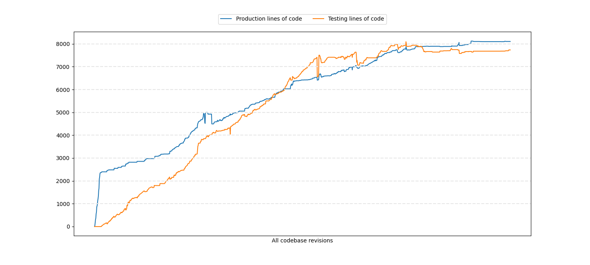
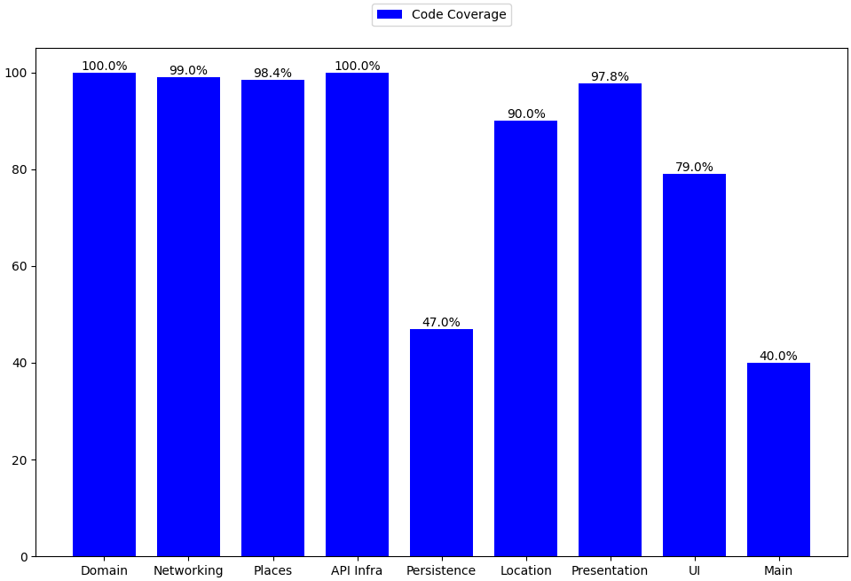

## Metrics

| Environment | Files Count | Total lines of code | Average lines per file |
|------|------|------|------|
| Production | 206 | 8103 | 39 |
| Testing | 93 | 7733 | 83 |

> ❗️ Blank lines and comments are not considered. 

### Test lines of code per production lines of code

Below, You can see the entire evolution of the codebase. For the first part of the project, the testing curve stayed flat as I initially worked on the UI, testing out different ideas. Afterwards, I went through the process of building the modules in the order presented here.

The usage of `TDD` throughout the project is proved by the lack of flat segments on the testing curve. Each commit contained changes in both testing and production, and their spikes are directly correlated. It highlights how important it was for me to have automated tests before writing production code.

### Count of files changed

My initial goal was to make commits as small as possible, very frequent, and with meaningful messages. Additionally, I strived for an average between `2 and 2.5` changed files per commit. Unfortunately, while polishing the last details of the project, I realised that I had used the concept of `place` instead of `restaurant` throughout the codebase. I had initially borrowed the naming from `Google Places`, and because they are similar and can be used interchangeably, as the set of places contains all restaurants.

However, I decided to replace the concepts everywhere in the project to maintain consistency with the initial purpose and to have meaningful domain models. Before the refactoring, I had an average of `2.35` files changed per commit. However, due to all the renaming that had to be done, it went up to `3.26`.

The following histogram represents the history of the number of files changed during the project. As you can see, `74% of all commits modified three or fewer files`. Moreover, most commits with more than ten files changed are due to renaming. Overall, the plot demonstrates my continuous effort of keeping high the granularity of the commits.

> ❗️ It `only` includes changes to Swift files.

### Code coverage

Having high code coverage wasn't a goal during the project. Instead, my focus was to write quality tests. The code coverage emerged as a consequence of following `TDD` while building the modules. It's a useful metric to check what portions of the code are not executed by tests. However, it doesn't guarantee that all possible paths have been tested.

The `Persistence` module has only `47%` code coverage due to `CoreDataLocalStore` has generic methods which I tested using only the `ManagedUser` to validate its behaviour, so all the other managed models are not covered.

In the case of the `Location` module, I was unable to trigger delegate methods, that's why in order to test them I implemented my own delegate. (You can find more details here: [Get current location using TDD](#get-current-location-using-tdd))

So far, I haven't done any unit testing on views since they don't contain business logic. I tested them only through snapshot testing to ensure the correct layout. I had the option to test them using a third-party framework, called `ViewInspector`, but I wasn't comfortable to add the required setup in production to make it work. For this reason, I decided to test the views' logic using the preview or manually if necessary.

This is also valid for the views in the composition root that handles the navigation, that's the reason the coverage is only `40%`.

In conclusion, all the modules are completely tested, except the view logic from the `UI` and `Main` modules. However, I kept it to the bare minimum and can be easily tested using the preview. It was a trade-off I had to make, and I'm considering using the framework to write some acceptance tests in the future. For now, I'm satisfied with the current solution and confident that my testing strategy will ensure the stability of the application.

